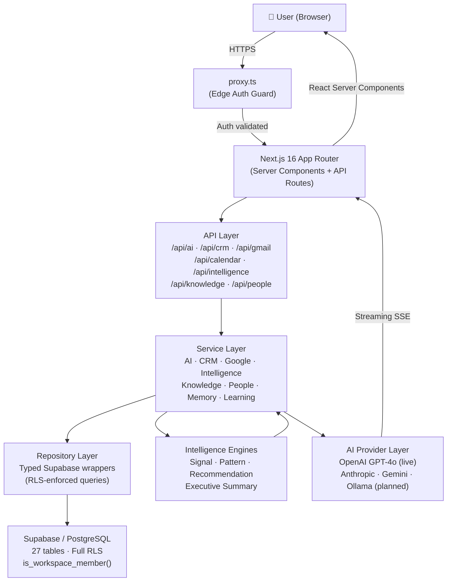
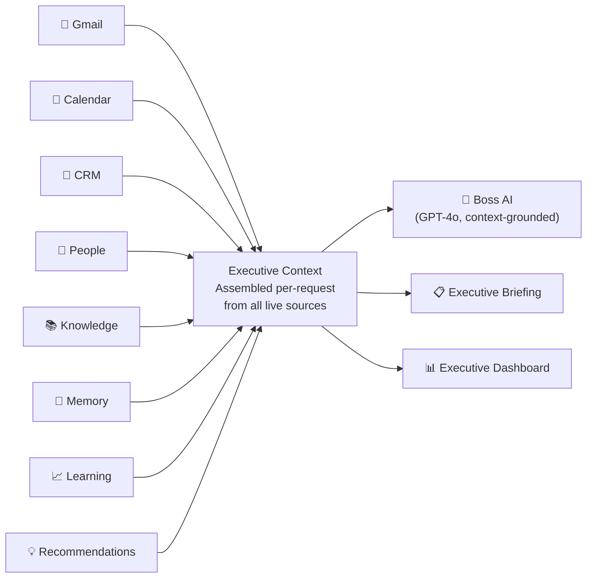
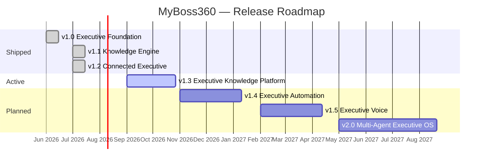

# MyBoss360

**Executive Operating System** — AI-powered command center that unifies CRM, email, calendar, people intelligence, memory, knowledge, and executive context into a single intelligent workspace.

[](https://github.com/myboss360/myboss360-web/actions/workflows/ci.yml)


---

## What is MyBoss360?

MyBoss360 is a full-stack AI Executive Operating System built for senior leaders who need to stay ahead of their business without being buried in it. It connects every data source that matters — Gmail, Google Calendar, CRM, contacts, documents, and internal knowledge — and synthesizes it through a layered intelligence architecture into briefings, signals, recommendations, and a conversational AI assistant that understands your business context.

The platform is multi-tenant from the ground up. Every organization and workspace is isolated by Row-Level Security enforced at the database layer. The AI assistant is grounded in live business data, not static training.

---

## Key Capabilities

| Capability | Description |
|---|---|
| **Executive Dashboard** | Live KPIs, signals, risks, opportunities, and agenda — assembled on every load from real data |
| **AI Assistant** | Streaming conversational AI grounded in live CRM, email, calendar, people, and knowledge context |
| **Executive Context Engine** | Assembles a rich intelligence context object on every AI request: metrics, risks, opportunities, signals, patterns, recommendations, people, email, and memory |
| **CRM** | Companies, contacts, deals, activities — with pipeline views, relationship scoring, and signal emission on every mutation |
| **Email Intelligence** | Gmail ingestion, thread summarization, priority classification, relationship extraction, and CRM linkage |
| **Calendar Intelligence** | Google Calendar sync, executive agenda view, meeting context enrichment |
| **People Intelligence** | Relationship strength scoring, engagement tracking, influence mapping, champion and decision-maker classification |
| **Memory Engine** | Persistent workspace memory: decisions, observations, preferences, meeting summaries, and AI insights — injected into every AI prompt |
| **Learning Engine** | Detects and stores behavioral signals across CRM, tasks, and projects; feeds the recommendation engine |
| **Knowledge Engine** | Document ingestion pipeline with paragraph, sentence, fixed-size, and semantic chunking strategies; keyword search live via trigram index |
| **Recommendation Engine** | Generates prioritized executive action recommendations from signals and patterns |
| **Executive Briefing** | On-demand and scheduled briefing generation with risk, opportunity, and action summaries |
| **Executive Health** | Real-time platform health endpoint: data freshness, sync status, signal counts |

---

## Architecture

### System Architecture



### Intelligence Architecture



---

## Tech Stack

| Layer | Technology |
|---|---|
| Framework | Next.js 16 (App Router, Turbopack) |
| Language | TypeScript (strict mode) |
| Database | PostgreSQL via Supabase |
| Auth | Supabase SSR (`@supabase/ssr`) — httpOnly cookies, `getUser()` revalidation |
| Security | Row-Level Security on all 27 tables; edge proxy auth guard |
| AI | OpenAI GPT-4o via pluggable provider registry; streaming via SSE |
| Styling | Tailwind CSS v4 + shadcn/ui |
| Testing | Vitest 4 with V8 coverage |
| CI/CD | GitHub Actions (lint → build → test on every push and PR) |
| Infrastructure | Supabase (auth, database, RLS); Vercel (hosting) |

---

## Project Structure

```
app/                         Next.js App Router
  (auth)/                    Login, register, forgot-password
  (dashboard)/               Executive dashboard and all sub-pages
    dashboard/               Home, AI assistant, CRM, Calendar, Tasks, Documents…
  (marketing)/               Public homepage
  (onboarding)/              8-step onboarding wizard
  api/                       REST API routes
    ai/                      Conversations and message streaming
    calendar/                Events and sync
    executive/               Briefing and health endpoints
    gmail/                   Sync and thread endpoints
    google/                  OAuth connect/callback/status/disconnect
    intelligence/            Executive context assembly
    knowledge/               Document CRUD and search
    onboarding/              Onboarding state and workspace provisioning
    people/                  Relationship intelligence endpoints

components/
  ai/                        AIChatWindow, AIComposer, AIConversationSidebar,
                             ExecutiveContextPanel, BossIntelligencePanel…
  crm/                       CRM entity tables, forms, pipeline views
  dashboard/                 AppShell, Sidebar, Topbar, KPI widgets, SectionCards
  onboarding/                Wizard steps and progress indicator

services/
  ai/                        Provider registry, OpenAI provider, prompt builder,
                             mock provider, future provider stubs
  crm/                       Full CRM service: companies, contacts, deals,
                             activities, leads, pipeline, audit
  dashboard/                 Executive summary service
  google/                    Gmail API client, sync service, thread intelligence,
                             relationship intelligence, contact extractor,
                             knowledge ingestion, Google Calendar API, OAuth service
  intelligence/              Signal engine, pattern detector, recommendation engine,
                             intelligence service (context assembly)
  knowledge/                 Document pipeline, search service, knowledge service
  learning/                  Learning service (signal storage and retrieval)
  memory/                    Memory service (workspace memory CRUD)
  onboarding/                Onboarding service, provisioning service
  people/                    People engine (scoring), people service

repositories/
  crm/                       Companies, contacts, deals, activities, leads, projects, tasks
  knowledge/                 Documents, chunks, collections, tags
  onboarding/                Onboarding state
  users/                     Profiles
  workspaces/                Workspaces

types/                       TypeScript type definitions
  ai.ts                      Provider, capability, generate request/response types
  crm.ts                     CRM view and config types
  database.ts                Auto-generated Supabase row/insert/update types (27 tables)
  executive.ts               Briefing, health, intelligence summary types
  intelligence.ts            IntelligenceContext, signals, patterns, recommendations
  knowledge.ts               Document, chunk, collection, search contract types
  learning.ts                LearningSignal, recommendation types
  memory.ts                  Memory entry types
  onboarding.ts              OnboardingStep, OnboardingState, WorkspaceSettings

config/                      Application configuration (no business logic)
  ai.ts                      System instructions, model defaults
  crm.ts                     Pipeline stages, field definitions, mock fallback
  dashboard.ts               Dashboard layout, widget config, metric definitions
  knowledge.ts               Document types, chunking config, categories

lib/
  dates.ts                   daysSince, daysUntil, daysSinceDate, clamp
  supabase/                  Browser client, server client, admin client

utils/
  formatters.ts              formatCurrency, formatCompactCurrency, formatRelativeTime,
                             formatPersonName, formatTitleCase, formatDateLabel

supabase/
  migrations/                Ordered SQL migration files (27 tables, full RLS)
  seed.sql                   Demo dataset: 1 org, 1 workspace, 10 companies,
                             12 contacts, 8 deals, 10 activities, 4 projects,
                             10 tasks, 5 calendar events

docs/                        Documentation
  architecture/              System, database ERD, AI architecture
  roadmap/                   CHANGELOG, RELEASE_BOARD, FEATURE_MATRIX, PRODUCT_VISION
  release-audit-v1.2.1.md   Pre-release state audit for v1.2.1
  technical-debt.md          Known limitations, architectural risks, priority backlog

tests/                       Vitest unit and integration tests
  lib/                       dates.ts — 18 tests
  repositories/crm/          companies, deals — repository contract tests
  services/ai/               provider registry, OpenAI provider, prompt builder
  services/crm/              runtime, workspace resolution
  services/intelligence/     signal engine — 15 tests
  services/onboarding/       ONBOARDING_STEPS, deriveOrgSlug
  services/people/           people engine scoring — 25 tests
```

---

## Getting Started

### Prerequisites

- **Node.js 22+**
- A **Supabase project** ([free tier](https://supabase.com) works for development)
- An **OpenAI API key** for the AI assistant
- **Google OAuth credentials** for Gmail and Calendar integrations

### 1. Clone and install

```bash
git clone https://github.com/myboss360/myboss360-web.git
cd myboss360-web
npm install
```

### 2. Configure environment

```bash
cp .env.example .env.local
```

Edit `.env.local` with your credentials. See [`.env.example`](.env.example) for all required variables with inline documentation.

### 3. Set up the database

Apply migrations to your Supabase project in order:

```bash
# Via Supabase CLI
supabase db push

# Or manually: paste each file from supabase/migrations/ into the SQL Editor
```

Optionally load demo data:

```bash
# Paste supabase/seed.sql into the SQL Editor
```

### 4. Start the development server

```bash
npm run dev
```

Open [http://localhost:3000](http://localhost:3000). Register an account — the onboarding wizard will provision your workspace automatically.

---

## Environment Variables

| Variable | Required | Description |
|---|---|---|
| `NEXT_PUBLIC_SUPABASE_URL` | ✅ | Your Supabase project URL |
| `NEXT_PUBLIC_SUPABASE_ANON_KEY` | ✅ | Supabase anon (public) key |
| `SUPABASE_SERVICE_ROLE_KEY` | ✅ | Service role key for workspace provisioning (server-only) |
| `NEXT_PUBLIC_APP_URL` | ✅ | Application base URL (e.g. `http://localhost:3000`) |
| `OPENAI_API_KEY` | ✅ | OpenAI API key for the AI assistant |
| `GOOGLE_CLIENT_ID` | ✅ for Google | Google OAuth 2.0 client ID |
| `GOOGLE_CLIENT_SECRET` | ✅ for Google | Google OAuth 2.0 client secret |
| `GOOGLE_REDIRECT_URI` | ✅ for Google | OAuth callback URL (e.g. `http://localhost:3000/api/google/callback`) |
| `GOOGLE_TOKEN_ENCRYPTION_KEY` | ✅ for Google | 32-byte hex key for AES-256-GCM token encryption |

Never commit `.env.local` to source control. All secrets are environment-scoped.

---

## Commands

| Command | Description |
|---|---|
| `npm run dev` | Start development server (Turbopack) |
| `npm run build` | Type-check and build for production |
| `npm run lint` | Run ESLint across all source files |
| `npm test` | Run full test suite (98 tests) |
| `npm run test:watch` | Run tests in watch mode |
| `npm run test:coverage` | Run tests with V8 coverage report |
| `npm start` | Start production server (requires prior build) |

---

## Releases

| Version | Theme | Status |
|---|---|---|
| **v1.2.1** | Architecture Freeze & Engineering Excellence | ✅ Current |
| v1.2.0 | Connected Executive — Google Workspace & People Intelligence | ✅ Shipped |
| v1.1.0 | Knowledge Engine — RAG Foundation | ✅ Shipped |
| v1.0.0 | Executive Foundation — Onboarding & Workspace Provisioning | ✅ Shipped |
| v0.6.0 | AI Infrastructure — OpenAI + Streaming | ✅ Shipped |
| v0.5.0 | Production Quality — Metrics, Memory, Learning | ✅ Shipped |
| v0.4.0 | CRM Production — Repository Layer + Seed Data | ✅ Shipped |
| v0.3.0 | Auth & Database Foundation — Supabase SSR + RLS | ✅ Shipped |

See the full [Changelog](docs/roadmap/CHANGELOG.md) and [Release Board](docs/roadmap/RELEASE_BOARD.md).

---

## Roadmap



| Version | Theme | Key Deliverables |
|---|---|---|
| **v1.3** | Executive Knowledge Platform | pgvector embeddings, semantic search (live), hybrid search, AI context injection from Knowledge Engine |
| **v1.4** | Executive Automation | Workflow engine, approval engine, no-code automation builder, multi-channel notifications |
| **v1.5** | Executive Voice | Voice assistant, real-time speech-to-text, text-to-speech, wake word activation |
| **v2.0** | Multi-Agent Executive OS | Autonomous agent swarm, cross-agent coordination, proactive executive management |

---

## Security Model

MyBoss360 is RLS-first. Security is enforced at multiple layers:

```
Request
  → Edge proxy (proxy.ts) — auth validated before server components run
  → API route — getUser() revalidated server-side (not getSession())
  → Service layer — explicit workspace ownership assertion on every mutation
  → Repository layer — all queries scoped by workspace_id
  → Supabase RLS — is_workspace_member() enforced at database level
```

- **Google tokens** are encrypted at rest with AES-256-GCM before database storage
- **OAuth CSRF** protection uses `crypto.timingSafeEqual` for nonce validation
- **Workspace isolation** is enforced at the service layer (explicit ownership check) and the database layer (RLS policies)
- **Service role client** is used only for workspace provisioning (new user first login); all other queries run under the user's session

---

## Development Workflow

```
GitHub Issue
    ↓
Sprint Planning (docs/roadmap/SPRINTS.md)
    ↓
Implementation with Claude Code
    ↓
npm run lint  →  npm run build  →  npm test
    ↓
Commit → Push → CI (GitHub Actions)
    ↓
Release tag → CHANGELOG update → Release audit
```

All sprints are tracked in [`docs/roadmap/SPRINTS.md`](docs/roadmap/SPRINTS.md). Each release produces a release audit document in [`docs/`](docs/).

---

## Quality Status

| Metric | Status |
|---|---|
| Test suite | ✅ 98 tests passing (12 test files) |
| Lint | ✅ Clean (ESLint, zero warnings) |
| Build | ✅ 32 routes, 0 errors (Turbopack) |
| TypeScript | ✅ Strict mode, zero `any` in core services |
| CI | ✅ Lint + Build + Test on every push and PR |
| Architecture | ✅ Service → Repository → RLS pattern enforced throughout |
| Security | ✅ RLS on all 27 tables; edge auth; workspace isolation on all mutations |

---

## Documentation

| Document | Description |
|---|---|
| [Architecture Overview](docs/architecture/README.md) | System design, data flow, module boundaries |
| [Database ERD](docs/architecture/database-erd.md) | All 27 tables, relationships, and RLS policies |
| [AI Architecture](docs/architecture/ai-architecture.md) | Provider registry, prompt construction, context injection |
| [Intelligence Architecture](docs/intelligence-architecture.md) | Signal engine, pattern detector, recommendation engine |
| [People Intelligence](docs/people-intelligence.md) | Relationship scoring model, engagement and influence metrics |
| [Knowledge Engine](docs/knowledge-engine.md) | Document pipeline, chunking strategies, search architecture |
| [Release Board](docs/roadmap/RELEASE_BOARD.md) | Shipped releases and planned roadmap |
| [Changelog](docs/roadmap/CHANGELOG.md) | Version history with full feature and fix details |
| [Feature Matrix](docs/roadmap/FEATURE_MATRIX.md) | Feature-by-feature status across all modules |
| [Release Audit v1.2.1](docs/release-audit-v1.2.1.md) | Pre-release state audit: architecture, coverage, security, performance |
| [Technical Debt](docs/technical-debt.md) | Known limitations, architectural risks, and prioritized backlog |

---

## License

Proprietary. All rights reserved.
