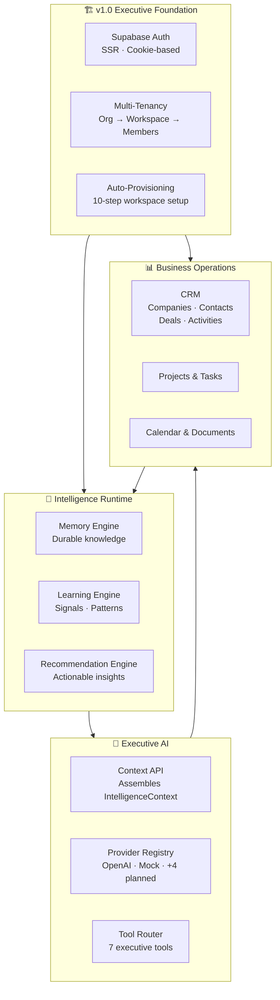

# MyBoss360 — Architecture Documentation

> **Release:** v1.0 Executive Foundation · June 2026
>
> **Audience:** CTO, Senior Engineers, AI Engineers, Investors, Enterprise Customers

This directory contains the complete enterprise architecture documentation for MyBoss360, the Executive Operating System.

---

## Navigation

| Document | Audience | Purpose |
|---|---|---|
| [system-architecture.md](system-architecture.md) | All | Complete platform architecture — stack, frontend, backend, auth, multi-tenancy, deployment |
| [database-erd.md](database-erd.md) | Engineers, Enterprise Customers | All 27 tables with ER diagram, column reference, RLS, indexes, multi-tenancy model |
| [ai-architecture.md](ai-architecture.md) | AI Engineers, CTO, Investors | Flagship AI document — Intelligence Runtime, Memory, Learning, Provider layer, security |

---

## Platform Overview

---

## Key Architectural Facts

| Fact | Detail |
|---|---|
| **Framework** | Next.js 16 App Router · React 19 · TypeScript |
| **Database** | PostgreSQL 15 (Supabase Cloud) · 27 tables · 4 migrations |
| **Auth** | `@supabase/ssr` cookie-based SSR — httpOnly, SameSite, Secure |
| **Multi-tenancy** | Organizations → Workspaces; RLS at DB layer via `is_workspace_member()` |
| **Repository pattern** | Factory functions `createXxxRepository(db)` — typed, testable, injectable |
| **AI providers** | OpenAI GPT-4o (live) · Mock (fallback) · 4 future providers scaffolded |
| **Intelligence** | Memory Engine + Signal Engine + Pattern Detector + Recommendation Engine |
| **Onboarding** | 10-step auto-provisioning on first login; 8-step wizard for company profile |
| **Deployment** | Vercel (SSR + API) + Supabase Cloud |

---

## Document Summaries

### [system-architecture.md](system-architecture.md)

The complete platform architecture document, covering:

- **Executive Summary** — technology decisions and their rationale
- **Product Philosophy** — why the architecture is intelligence-first
- **High-Level Architecture** — full Mermaid flowchart from user to database
- **Frontend** — App Router groups, dashboard module map, RSC vs. client island pattern
- **Backend** — API routes, service layer, repository layer with factory pattern
- **Authentication** — `@supabase/ssr`, SSR `getUser()`, dual client pattern, protected routes
- **Multi-Tenant Architecture** — dual membership model, RLS helper functions, isolation guarantees
- **Intelligence Runtime** — Signal Engine, Pattern Detector, Recommendation Engine, Context API
- **AI Layer** — Provider Registry, Prompt Builder (overview; see ai-architecture.md for full spec)
- **Deployment** — GitHub → GitHub Actions → Vercel + Supabase, environment variables, migrations
- **Future Roadmap** — 12 planned features with priority and description

**Start here** if you're a new engineer, investor, or enterprise evaluator trying to understand the platform.

---

### [database-erd.md](database-erd.md)

The complete database specification, covering:

- **Full ER Diagram** — all 27 entities with columns and relationships in Mermaid ERD format
- **Table Reference** — every table with column types, constraints, and business semantics
- **RLS Policies** — per-table SELECT/INSERT/UPDATE policies and the security rationale
- **Multi-Tenancy Model** — dual membership pattern and workspace isolation guarantees
- **Indexes** — all performance indexes with their query optimization purpose
- **Soft Deletes** — which tables use soft delete vs. hard cascade, and why

**Table groups:**
- Core SaaS: `profiles`, `organizations`, `roles`, `workspaces`, `memberships`
- CRM: `companies`, `contacts`, `leads`, `deals`, `activities`
- Business Ops: `projects`, `tasks`, `calendar_events`, `documents`
- AI: `ai_conversations`, `ai_messages`
- Memory Engine: `memories`, `memory_events`
- Learning Engine: `learning_signals`, `learning_patterns`, `recommendations`, `recommendation_feedback`
- Onboarding: `onboarding_state`, `workspace_settings`, `executive_profiles`

---

### [ai-architecture.md](ai-architecture.md)

The flagship AI architecture document. Essential reading for AI engineers, investors, and enterprise customers evaluating the intelligence capabilities of MyBoss360.

Covers:

- **Executive AI Vision** — why MyBoss360 AI is fundamentally different from chatbots
- **MyBoss360 Intelligence vs. LLM Providers** — clear separation of responsibilities
- **Full Architecture Diagram** — from executive query to Supabase and back
- **Memory Engine** — 10 memory types, event audit trail, executive context assembly
- **Learning Engine** — signal → pattern → recommendation pipeline in detail
- **Signal Engine** — all signal types with trigger conditions and severity levels
- **Pattern Detector** — cross-entity analysis algorithms and detection windows
- **Recommendation Engine** — deduplication, expiry, feedback loop design
- **Executive Context API** — parallel assembly of `IntelligenceContext`, data structure
- **Prompt Builder** — complete prompt structure injected into every LLM call
- **Conversation Manager** — persistence lifecycle for AI conversations
- **Tool Router** — 7 executive tools with function calling specification
- **Provider Registry** — `AIProvider` interface, resolution order, fallback logic
- **Mock Provider** — deterministic fallback and demo capabilities
- **OpenAI Provider** — live GPT-4o integration details
- **Future Subsystems** — MCP integration, Knowledge Graph, Voice Assistant, Multi-Agent System
- **Security** — auth, workspace isolation, prompt security, audit trail, RBAC roadmap
- **The Living Executive Operating System** — architectural vision for continuous learning

---

## Additional Documentation

| Document | Location |
|---|---|
| Onboarding & Provisioning | [docs/onboarding.md](../onboarding.md) |
| Intelligence Architecture (earlier draft) | [docs/intelligence-architecture.md](../intelligence-architecture.md) |
| AI Architecture (earlier draft) | [docs/ai-architecture.md](../ai-architecture.md) |
| Executive Runtime | [docs/executive-runtime.md](../executive-runtime.md) |
| Supabase Setup | [docs/supabase-setup.md](../supabase-setup.md) |
| Environment Configuration | [docs/environments.md](../environments.md) |
