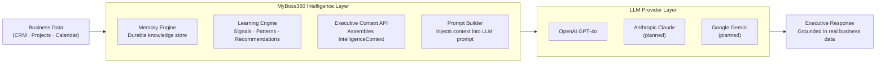
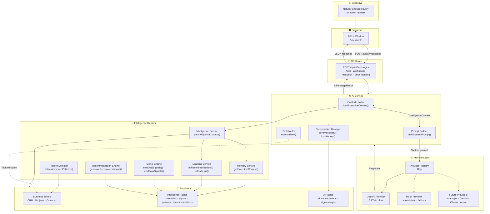
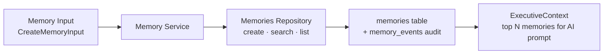
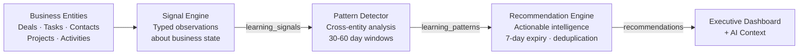
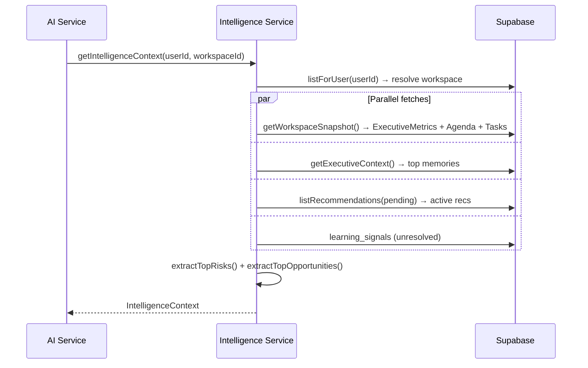
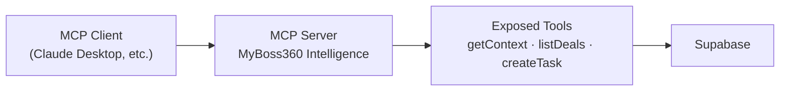
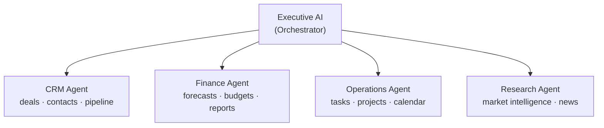

# MyBoss360 — AI Architecture

> **Audience:** CTO, AI Engineers, Senior Engineers, Enterprise Customers, Investors
>
> **Release:** v1.0 Executive Foundation · June 2026
>
> *This is the flagship architecture document for MyBoss360's AI layer.*

---

## Executive AI Vision

Most AI assistants are **reactive** — they answer what you ask, with no knowledge of your business and no memory of what you told them yesterday.

MyBoss360's Executive AI is **proactive and context-native**:

> *"When you open a conversation with Executive AI, it already knows your pipeline value, your overdue deals, your at-risk projects, your top recommendations, and today's agenda. You don't have to brief it. It briefs you."*

This is not prompt engineering. It is an **intelligence architecture** — a system where business data flows continuously through memory, learning, and context assembly layers before it ever reaches an LLM.

---

## The Fundamental Distinction

### LLM Providers vs. MyBoss360 Intelligence

These are two distinct systems with different responsibilities:



| Responsibility | MyBoss360 Intelligence | LLM Provider |
|---|---|---|
| Business data access | ✅ Owns | ❌ Never touches |
| Memory and context | ✅ Builds and maintains | ❌ Stateless |
| Signal detection | ✅ Runs continuously | ❌ Not applicable |
| Pattern recognition | ✅ Business-domain patterns | Language patterns only |
| Language generation | ❌ Delegates | ✅ Owns |
| Reasoning | ❌ Delegates | ✅ Owns |

**The LLM is a reasoning engine, not a data engine.** It receives a structured, pre-assembled context from MyBoss360 and generates the executive's response. All business logic, data access, and memory management is handled within MyBoss360's infrastructure.

---

## Full Architecture



---

## Subsystems

### Memory Engine

The Memory Engine is the institutional knowledge layer of MyBoss360. It stores business intelligence as structured, typed, searchable memories that outlast individual conversations.

**Architecture:**



**Memory Types:**

| Type | Source | Description |
|---|---|---|
| `user_preference` | Manual / AI | Executive working style, preferences |
| `org_goal` | Manual | Strategic organizational objectives |
| `workspace_context` | System | Workspace initialization notes |
| `decision` | Manual / AI | Key decisions made by the executive |
| `meeting_summary` | AI | Summarized meeting outcomes |
| `observation` | AI | Pattern-based observations |
| `executive_note` | Manual | Free-form executive notes |
| `ai_insight` | AI | AI-generated business insights |
| `accepted_recommendation` | System | Records of accepted AI recommendations |
| `rejected_recommendation` | System | Records of rejected recommendations (improves future suggestions) |

**Memory Event Audit Trail:**
Every memory write is accompanied by an immutable `memory_events` record with `event_type`: `created`, `updated`, `accessed`, `archived`, or `expired`. This provides a complete audit log of how the executive's knowledge base has evolved.

**Executive Context Assembly:**
`MemoryService.getExecutiveContext(workspaceId, organizationId)` retrieves the most relevant memories (pinned first, then recent) for injection into the AI system prompt. Memories with `expires_at` in the past are automatically excluded.

---

### Learning Engine

The Learning Engine continuously monitors business data and generates a three-stage intelligence pipeline: signals → patterns → recommendations.



---

### Signal Engine

The Signal Engine (`services/intelligence/signal-engine.ts`) evaluates individual business entities against configurable thresholds and emits structured `learning_signals` when conditions are met.

**Signal Emission Logic:**

| Entity Type | Condition | Signal | Severity |
|---|---|---|---|
| Deal | Approaching close date (≤7 days) with late stage | `deal_risk` | `warning` |
| Deal | Close date ≤3 days | `deal_risk` | `critical` |
| Deal | Low probability (< threshold) in late stage | `deal_risk` | `info` |
| Task | High-priority task overdue | `task_delay` | `warning` |
| Contact | No activity for threshold days | `follow_up_delay` | `info` |
| Project | Progress stalled + at-risk deadline | `performance_trend` | `warning` |
| Workspace | New workspace created | `workspace_created` | `info` |

**Signal deduplication:** The Signal Engine does not re-emit a signal for the same entity if an unresolved signal of the same type exists. Signals are marked `resolved_at` when the underlying condition is remediated.

---

### Pattern Detector

The Pattern Detector (`services/intelligence/pattern-detector.ts`) operates at a higher level than individual signals — it performs cross-entity analysis over 30- and 60-day historical windows to identify recurring behavioral patterns.

**Detection Algorithms:**

| Pattern | Analysis Window | Method |
|---|---|---|
| Stale pipeline | 30 days | Deals with no `updated_at` change in > N days |
| Overdue task cluster | Current | Multiple overdue high-priority tasks across projects |
| Contact engagement gap | 30 days | Contacts with no linked activities |
| Activity velocity drop | 60-day comparison | Activities created in last 30 vs. prior 30 days |
| Win rate trend | 60 days | `closed_won` / total closed deals ratio |

Each detected pattern receives a `confidence` score (0.00–1.00) that increases with the number of occurrences. High-confidence patterns generate high-priority recommendations.

---

### Recommendation Engine

The Recommendation Engine (`services/intelligence/recommendation-engine.ts`) converts Pattern Detector output into typed, actionable recommendation cards for the executive.

**Key Design Decisions:**

- **Deduplication by title**: The engine loads all pending recommendations before creating new ones. If a recommendation with the same title already exists, it is skipped (not duplicated).
- **7-day expiry**: Every recommendation receives an `expires_at` timestamp 7 days in the future. Expired recommendations are excluded from the context automatically.
- **Cap per workspace**: Maximum pending recommendations per workspace is bounded by `intelligenceConfig.maxTopOpportunities * 2` to prevent flooding.
- **Feedback loop**: When the executive accepts, rejects, or dismisses a recommendation via `POST /api/onboarding` (or future CRM actions), a `recommendation_feedback` row is created. Rejected recommendations of a given type can be used to reduce future signal sensitivity.

**Recommendation Types:**

| Type | Description | Example |
|---|---|---|
| `action` | Specific step the executive should take | "Follow up with Acme Corp — 14 days silent" |
| `insight` | Data-driven business observation | "Average deal age up 23% this month" |
| `warning` | Risk requiring attention | "3 deals risk missing Q2 close target" |
| `opportunity` | Growth or revenue opportunity | "Contact Y referenced renewal — schedule call" |

---

### Executive Context API

The Executive Context API (`services/intelligence/intelligence-service.ts`) is the central assembly point. It aggregates all intelligence data sources into a single `IntelligenceContext` object in a single parallel fetch round-trip.

**Assembly Pipeline:**



**`IntelligenceContext` structure:**

```typescript
interface IntelligenceContext {
  workspaceId: string
  organizationId: string
  executiveMetrics: {
    totalPipelineValue: number
    activeDeals: number
    atRiskDealsCount: number
    avgDealAgedays: number
    closedWonThisMonth: number
    closedWonValueThisMonth: number
    overdueTasksCount: number
    atRiskProjectsCount: number
    upcomingMeetingsCount: number
  }
  recentMemories: Memory[]           // top 5, pinned-first
  activeRecommendations: Recommendation[]
  learningSignals: LearningSignal[]  // unresolved signals
  topRisks: ExecutiveRisk[]
  topOpportunities: ExecutiveOpportunity[]
  todayAgenda: TodayAgendaItem[]
  importantTasks: ImportantTask[]    // overdue + high priority
  generatedAt: string
}
```

---

### Prompt Builder

`buildSystemPrompt()` (`services/ai/prompt-builder.ts`) converts the `IntelligenceContext` into a structured LLM system prompt. It is the single point of contact between the intelligence layer and the LLM.

**Prompt Structure:**

```
[SYSTEM INSTRUCTIONS]
Role definition, response style, no hallucination directive

--- USER ---
Name · Workspace ID · Organization ID · Current date

--- EXECUTIVE METRICS ---
Pipeline value · Active deals · At-risk deals · Avg deal age
Closed won this month · Overdue tasks · Upcoming meetings

--- TOP RISKS ---
[Up to N ranked risks with severity and description]

--- OPPORTUNITIES ---
[Up to N ranked opportunities]

--- ACTIVE RECOMMENDATIONS ---
[Up to 5 pending recommendations with priority and CTA]

--- STRATEGIC MEMORY ---
[Up to 5 relevant memories: type, title, content snippet]

--- TODAY'S AGENDA ---
[Time-sorted calendar items]

--- OVERDUE HIGH-PRIORITY TASKS ---
[Up to 5 tasks]

--- AVAILABLE TOOLS ---
[Tool schema list for function calling]

--- INSTRUCTIONS ---
Answer using the business context above.
Be direct and concise.
Cite specific numbers when available.
Do not fabricate data not present in context.
```

**Design principle:** The prompt is deterministic and reproducible. Given the same `IntelligenceContext`, it produces the same prompt structure — enabling prompt debugging, regression testing, and audit.

---

### Conversation Manager

`ConversationManager` (`services/ai/conversation-manager.ts`) handles the persistence lifecycle of AI conversations:

1. **On new conversation**: creates `ai_conversations` row with `workspace_id`, `organization_id`, `user_id`.
2. **On message send**: saves the user message, calls the provider, saves the assistant message.
3. **On conversation load**: retrieves full message history for context injection (system messages stored but filtered in UI).
4. **Title generation**: derives conversation title from the first user message (first 60 chars).

---

### Tool Router

`ToolRouter` (`services/ai/tool-router.ts`) handles LLM function calling. When a provider returns `finishReason: 'tool_call'`, the Tool Router:

1. Parses the structured `AIToolCall` from the provider response.
2. Routes to the appropriate internal handler.
3. Returns an `AIToolResult` that is appended to the message history.
4. Calls the provider again with the tool result for a final response.

**Available Tools:**

| Tool | Description |
|---|---|
| `getExecutiveContext` | Re-fetch the full `IntelligenceContext` (cache-busting) |
| `listDeals` | List active deals filtered by stage |
| `listTasks` | List tasks filtered by status/priority |
| `summarizePipeline` | Structured pipeline breakdown by stage, value, risk |
| `createTask` | Create a new task in the workspace |
| `updateDealStage` | Move a deal to a new pipeline stage |
| `createRecommendationFeedback` | Accept, reject, or dismiss a recommendation |

---

### Provider Registry

The Provider Registry (`services/ai/provider-registry.ts`) is a module-level singleton `Map<string, AIProvider>`. It decouples the entire AI system from any specific LLM.

```typescript
interface AIProvider {
  id: string
  name: string
  modelId: string
  capabilities: AICapability[]   // 'text' | 'tool_use' | 'vision' | 'code'
  maxContextTokens: number
  supportsStreaming: boolean
  status: AIProviderStatus       // 'active' | 'unavailable' | 'rate_limited' | 'unconfigured'
  generate(request: GenerateRequest): Promise<GenerateResponse>
  stream?(request: GenerateRequest): AsyncIterable<StreamChunk>
}
```

**Provider resolution order:**
1. If a `preferredId` is specified and that provider is `active` → use it.
2. Otherwise, iterate registered providers and return the first `active` one.
3. If no `active` provider exists → throw `'No active AI provider is registered.'`

This means the system gracefully degrades: if OpenAI is unavailable (rate limit, outage), the Mock Provider activates automatically — preserving the user experience.

---

### Mock Provider

The Mock Provider (`services/ai/providers/mock-provider.ts`) is a fully deterministic AI provider that returns structured business-aware responses without calling any external API.

**Purpose:**
- Development: full AI workflow without API keys
- Testing: predictable, reproducible responses for unit and integration tests
- Fallback: keeps the system functional if all real providers are unavailable
- Demo: show investors and customers the full AI experience without live credentials

**Behavior:** Generates contextually relevant responses by examining the `IntelligenceContext` in the system prompt — references real pipeline values, deal counts, and recommendations from the context.

---

### OpenAI Provider

The OpenAI Provider (`services/ai/providers/openai-provider.ts`) connects to the OpenAI API using the standard REST interface (no SDK dependency). It supports:

- **Model**: GPT-4o (`gpt-4o`) — 128K context window
- **Capabilities**: text, tool_use, vision, code
- **Function calling**: structured tool call parsing from OpenAI `tool_calls` response format
- **Error classification**: maps HTTP 401, 429, 502, 503 to user-facing messages without leaking internals

---

## Future AI Subsystems

### Future Providers

All future providers are scaffolded in `services/ai/providers/future-providers.ts` as `UnimplementedProvider` subclasses. Wiring a new provider requires only:

1. Implement `generate()` and optionally `stream()`
2. Set `status: 'active'`
3. Register with `registerProvider(new XxxProvider())`

| Provider | Model | Context | Status |
|---|---|---|---|
| `FutureAnthropicProvider` | `claude-sonnet-4-6` | 200K tokens | Scaffolded |
| `FutureGeminiProvider` | `gemini-2.0-flash` | 1M tokens | Scaffolded |
| `FutureOllamaProvider` | `llama3.2` | 128K tokens | Scaffolded |
| `FutureAzureProvider` | `gpt-4o` (Azure) | 128K tokens | Scaffolded |

### Future MCP Integration

Model Context Protocol (MCP) will enable MyBoss360 to expose its intelligence layer as a tool ecosystem to any compatible AI client. Integration plan:



### Future Knowledge Graph

The current Memory Engine stores memories as flat records. The Knowledge Graph layer will add:

- Entity nodes: `Company`, `Contact`, `Deal`, `Executive`, `Workspace`
- Relationship edges: `works_for`, `manages`, `influences`, `refers`
- Graph traversal: identify second-degree connections, influence paths, referral chains
- AI integration: relationship context injected alongside standard memories

### Future Voice Assistant

A voice-first interface that routes speech input directly to Executive AI:

```
Voice Input → Speech-to-Text → Executive AI → Text-to-Speech → Audio Output
```

The same `IntelligenceContext` and `PromptBuilder` pipeline is used — the voice layer is purely an I/O transformation.

### Future Multi-Agent System

The Executive AI will evolve from a single assistant to a coordinated network of specialist agents:



The orchestrator receives the executive's query, decomposes it across specialist agents, aggregates their outputs, and delivers a unified executive-grade response.

---

## Security

### Authentication

All AI API routes enforce authentication as the first operation:

```typescript
const { data: { user } } = await supabase.auth.getUser()
if (!user) return NextResponse.json({ error: 'Unauthorized' }, { status: 401 })
```

The Supabase server client validates the JWT cryptographically — no cookie-level trust.

### Workspace Isolation

The AI service resolves the workspace exclusively from the authenticated user's memberships:

```typescript
const workspaces = await workspacesRepo.listForUser(user.id)
// → SELECT workspaces.* JOIN memberships WHERE user_id = $userId
```

A user cannot access another workspace's AI conversations or intelligence context even by guessing a workspace ID in the request body — the resolution always starts from the authenticated identity.

### Prompt Security

- The system prompt is built entirely from server-side data. No user-supplied content enters the system prompt.
- The `buildSystemPrompt()` function only reads from the pre-assembled `IntelligenceContext` — it does not access the database directly.
- Provider API keys (`OPENAI_API_KEY`) are server-only environment variables — never prefixed with `NEXT_PUBLIC_` and never accessible to the browser bundle.

### Audit Trail

- Every AI conversation and message is persisted in `ai_conversations` / `ai_messages`.
- Every memory write generates a `memory_events` record.
- Every recommendation response generates a `recommendation_feedback` record.
- Together, these tables provide a complete audit trail of every AI interaction and its business impact.

### Rate Limits

Current implementation:
- `429` from OpenAI is mapped to a user-friendly message: *"The AI provider is busy. Please wait a moment and try again."*
- No user-level rate limiting implemented yet (Sprint 19 item).

Planned: per-user request rate limiting in the API route using Redis or Supabase-based counters.

### Permissions

Current implementation: all authenticated workspace members have full AI access.

Planned RBAC model:

| Permission | Executive | Manager | Viewer |
|---|---|---|---|
| Send AI messages | ✅ | ✅ | ❌ |
| Read conversation history | ✅ | Own only | ❌ |
| Access intelligence context | ✅ | ✅ | ✅ |
| Manage recommendations | ✅ | ✅ | ❌ |
| Access executive profiles | ✅ | ❌ | ❌ |

---

## The Living Executive Operating System

> *"MyBoss360 is not a chatbot with a CRM attached. It is an operating system — a persistent, self-improving intelligence layer that understands your business more deeply with every interaction."*

The architectural properties that make this possible:

| Property | How It's Achieved |
|---|---|
| **Persistent memory** | Memories outlast conversations; pinned memories appear in every context |
| **Continuous intelligence** | Signal Engine and Pattern Detector run on business data, not on user queries |
| **Contextual AI** | Every LLM call receives a fully assembled business context — no generic responses |
| **Provider agnosticism** | Business logic is completely decoupled from any specific LLM |
| **Workspace isolation** | Each executive's intelligence is private — cryptographically enforced at the DB layer |
| **Feedback loops** | Accepted/rejected recommendations feed back into the learning pipeline |
| **Evolvability** | New providers, new tools, new agent types can be added without touching the intelligence layer |

As the executive uses MyBoss360:
1. More memories accumulate → AI context becomes richer
2. More signals are emitted → patterns become more confident
3. Recommendations become more accurate → executive accepts more → learning loop tightens
4. Pattern Detector accumulates more historical data → detects subtler trends

This is the arc from a helpful assistant to an indispensable operating system.
