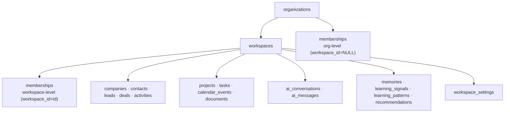

# MyBoss360 — Database Entity Relationship Diagram

> **Audience:** CTO, Senior Engineers, Database Architects, Enterprise Customers
>
> **Database:** PostgreSQL 15 via Supabase Cloud · 27 tables across 4 migrations

---

## Overview

MyBoss360's database is structured around three tiers:

1. **SaaS Foundation** — organizations, workspaces, users, memberships, roles
2. **Executive Intelligence** — memories, learning signals, patterns, recommendations
3. **Business Operations** — CRM, projects, tasks, calendar, documents, AI conversations
4. **Onboarding** — wizard state, workspace settings, executive profiles

All tables follow consistent conventions:
- **Primary keys**: `UUID`, generated via `gen_random_uuid()`
- **Timestamps**: `created_at`, `updated_at` (auto-stamped via trigger); `deleted_at` for soft deletes
- **Multi-tenancy**: every business table references both `workspace_id` and `organization_id`
- **RLS**: Row Level Security enabled on all tables; no table is publicly accessible

---

## Complete ER Diagram

```mermaid
erDiagram
    %% ─── AUTH ───
    auth_users {
        uuid id PK
        text email
        jsonb raw_user_meta_data
    }

    %% ─── CORE SAAS ───
    profiles {
        uuid id PK
        text full_name
        text avatar_url
        text phone
        text timezone
        timestamptz created_at
        timestamptz updated_at
    }

    organizations {
        uuid id PK
        text name
        text slug
        text logo_url
        text website
        text plan
        timestamptz created_at
        timestamptz updated_at
        timestamptz deleted_at
    }

    roles {
        uuid id PK
        uuid organization_id FK
        text name
        text description
        bool is_system
    }

    workspaces {
        uuid id PK
        uuid organization_id FK
        text name
        text slug
        text description
        timestamptz deleted_at
    }

    memberships {
        uuid id PK
        uuid user_id FK
        uuid organization_id FK
        uuid workspace_id FK
        uuid role_id FK
        text status
        text invited_email
        timestamptz joined_at
    }

    %% ─── CRM ───
    companies {
        uuid id PK
        uuid workspace_id FK
        text name
        text domain
        text industry
        text size
        text website
        jsonb address
        timestamptz deleted_at
    }

    contacts {
        uuid id PK
        uuid workspace_id FK
        uuid company_id FK
        text first_name
        text last_name
        text email
        text phone
        text job_title
        text linkedin_url
        timestamptz deleted_at
    }

    leads {
        uuid id PK
        uuid workspace_id FK
        uuid company_id FK
        uuid contact_id FK
        text title
        text status
        numeric value
        text source
        timestamptz deleted_at
    }

    deals {
        uuid id PK
        uuid workspace_id FK
        uuid company_id FK
        uuid contact_id FK
        uuid lead_id FK
        text title
        text stage
        numeric value
        text currency
        int probability
        date expected_close_date
        timestamptz deleted_at
    }

    activities {
        uuid id PK
        uuid workspace_id FK
        uuid company_id FK
        uuid contact_id FK
        uuid deal_id FK
        uuid created_by FK
        text type
        text subject
        text notes
        timestamptz occurred_at
    }

    %% ─── PROJECTS ───
    projects {
        uuid id PK
        uuid workspace_id FK
        uuid owner_id FK
        text name
        text description
        text status
        date start_date
        date end_date
        int progress
        timestamptz deleted_at
    }

    tasks {
        uuid id PK
        uuid workspace_id FK
        uuid project_id FK
        uuid assigned_to FK
        uuid created_by FK
        text title
        text status
        text priority
        date due_date
        timestamptz deleted_at
    }

    %% ─── CALENDAR ───
    calendar_events {
        uuid id PK
        uuid workspace_id FK
        uuid created_by FK
        text title
        text description
        timestamptz start_at
        timestamptz end_at
        text location
        text type
        bool is_all_day
    }

    %% ─── DOCUMENTS ───
    documents {
        uuid id PK
        uuid workspace_id FK
        uuid created_by FK
        text title
        text content
        text status
        text type
        timestamptz deleted_at
    }

    %% ─── AI ───
    ai_conversations {
        uuid id PK
        uuid workspace_id FK
        uuid organization_id FK
        uuid user_id FK
        text title
        text model
        jsonb metadata
        timestamptz deleted_at
    }

    ai_messages {
        uuid id PK
        uuid conversation_id FK
        text role
        text content
        int tokens_used
        jsonb metadata
        timestamptz created_at
    }

    %% ─── MEMORY ENGINE ───
    memories {
        uuid id PK
        uuid workspace_id FK
        uuid organization_id FK
        uuid user_id FK
        text type
        text title
        text content
        text source
        text entity_type
        uuid entity_id
        numeric confidence
        bool is_pinned
        timestamptz expires_at
        jsonb metadata
        uuid created_by FK
        timestamptz deleted_at
    }

    memory_events {
        uuid id PK
        uuid memory_id FK
        text event_type
        uuid actor_id FK
        jsonb metadata
        timestamptz created_at
    }

    %% ─── LEARNING ENGINE ───
    learning_signals {
        uuid id PK
        uuid workspace_id FK
        uuid organization_id FK
        text signal_type
        text entity_type
        uuid entity_id
        text severity
        text title
        text description
        jsonb data
        timestamptz detected_at
        timestamptz resolved_at
    }

    learning_patterns {
        uuid id PK
        uuid workspace_id FK
        uuid organization_id FK
        text pattern_type
        text name
        text description
        numeric confidence
        int occurrences
        timestamptz last_seen_at
        jsonb data
    }

    recommendations {
        uuid id PK
        uuid workspace_id FK
        uuid organization_id FK
        uuid user_id FK
        uuid pattern_id FK
        uuid signal_id FK
        text type
        text priority
        text title
        text description
        text action_label
        text entity_type
        uuid entity_id
        text status
        timestamptz expires_at
    }

    recommendation_feedback {
        uuid id PK
        uuid recommendation_id FK
        uuid user_id FK
        text action
        jsonb metadata
        timestamptz created_at
    }

    %% ─── ONBOARDING ───
    onboarding_state {
        uuid id PK
        uuid user_id UK
        uuid organization_id FK
        uuid workspace_id FK
        text current_step
        text[] completed_steps
        timestamptz completed_at
    }

    workspace_settings {
        uuid id PK
        uuid workspace_id UK
        text company_name
        text industry
        text website
        text country
        text timezone
        text language
        text currency
        text[] business_goals
        jsonb metadata
    }

    executive_profiles {
        uuid id PK
        uuid user_id UK
        uuid workspace_id FK
        text full_name
        text role_title
        text communication_style
        text ai_tone
        text meeting_style
        text decision_style
    }

    %% ─── RELATIONSHIPS ───
    auth_users ||--|| profiles : "1:1 on signup trigger"
    auth_users ||--o{ memberships : "has many"
    organizations ||--o{ workspaces : "owns"
    organizations ||--o{ memberships : "has many"
    organizations ||--o{ roles : "defines"
    workspaces ||--o{ memberships : "has members"
    workspaces ||--o{ companies : "owns"
    workspaces ||--o{ contacts : "owns"
    workspaces ||--o{ leads : "owns"
    workspaces ||--o{ deals : "owns"
    workspaces ||--o{ activities : "owns"
    workspaces ||--o{ projects : "owns"
    workspaces ||--o{ tasks : "owns"
    workspaces ||--o{ calendar_events : "owns"
    workspaces ||--o{ documents : "owns"
    workspaces ||--o{ ai_conversations : "owns"
    workspaces ||--o{ memories : "owns"
    workspaces ||--o{ learning_signals : "owns"
    workspaces ||--o{ learning_patterns : "owns"
    workspaces ||--o{ recommendations : "owns"
    workspaces ||--|| workspace_settings : "has one"
    companies ||--o{ contacts : "has many"
    companies ||--o{ deals : "linked"
    contacts ||--o{ deals : "linked"
    deals ||--o{ activities : "has many"
    ai_conversations ||--o{ ai_messages : "has many"
    memories ||--o{ memory_events : "audit trail"
    learning_signals ||--o{ recommendations : "triggers"
    learning_patterns ||--o{ recommendations : "informs"
    recommendations ||--o{ recommendation_feedback : "receives"
    auth_users ||--o| onboarding_state : "has one"
    auth_users ||--o| executive_profiles : "has one"
    memberships }o--|| roles : "assigned"
```

---

## Table Reference

### Core SaaS

#### `profiles`

One-to-one with `auth.users`. Auto-created by the `handle_new_user()` trigger on signup.

| Column | Type | Notes |
|---|---|---|
| `id` | UUID PK | References `auth.users(id) ON DELETE CASCADE` |
| `full_name` | TEXT | Set from `raw_user_meta_data` on signup |
| `avatar_url` | TEXT | Set from OAuth provider or registration |
| `timezone` | TEXT | Defaults to `'UTC'` |

**RLS:** SELECT/UPDATE where `id = auth.uid()`.

---

#### `organizations`

The top-level tenant. Every organization gets a unique slug used in URLs and API routing.

| Column | Type | Notes |
|---|---|---|
| `id` | UUID PK | `gen_random_uuid()` |
| `slug` | TEXT UNIQUE | Derived from email domain + `Date.now().toString(36)` suffix |
| `plan` | TEXT | `free` \| `pro` \| `enterprise` |
| `deleted_at` | TIMESTAMPTZ | Soft delete |

**RLS:** SELECT/UPDATE for `is_org_member(id)`. INSERT via service role only.

---

#### `workspaces`

A workspace is a functional unit within an organization (team, department, or executive unit). All business data belongs to a workspace.

| Column | Type | Notes |
|---|---|---|
| `organization_id` | UUID FK | Parent organization |
| `slug` | TEXT | Unique within organization (`UNIQUE(organization_id, slug)`) |
| `deleted_at` | TIMESTAMPTZ | Soft delete |

**RLS:** SELECT/UPDATE/INSERT for `is_workspace_member(id)`.

---

#### `memberships`

Dual-row design: every user has an org-level membership (`workspace_id IS NULL`) and one or more workspace-level memberships (`workspace_id IS NOT NULL`). The workspace-level row is required for PostgREST inner join queries.

| Column | Type | Notes |
|---|---|---|
| `workspace_id` | UUID FK (nullable) | NULL = org-level membership |
| `role_id` | UUID FK | Links to `roles` table |
| `status` | TEXT | `active` \| `invited` \| `suspended` |

**Unique indexes (partial):**
- `(user_id, organization_id) WHERE workspace_id IS NULL` — one org membership per user per org
- `(user_id, organization_id, workspace_id) WHERE workspace_id IS NOT NULL` — one workspace membership per user per workspace

---

### CRM

#### `companies`

Accounts / customer organizations tracked in the CRM.

| Column | Type | Notes |
|---|---|---|
| `domain` | TEXT | Used for company matching and deduplication |
| `industry` | TEXT | Free-text or from onboarding config list |
| `address` | JSONB | `{street, city, state, country, zip}` |
| `deleted_at` | TIMESTAMPTZ | Soft delete |

**Indexes:** `workspace_id`, trigram index on `name` (via `pg_trgm`) for fuzzy search.

---

#### `contacts`

Individual people within companies. Linked to companies and referenced by deals and activities.

| Column | Type | Notes |
|---|---|---|
| `company_id` | UUID FK (nullable) | May be a standalone contact |
| `email` | TEXT | Not unique — multiple contacts may share emails |
| `deleted_at` | TIMESTAMPTZ | Soft delete |

---

#### `leads`

Pre-qualification stage before a deal is created. Tracks lead source and conversion status.

| Column | Type | Notes |
|---|---|---|
| `status` | TEXT | `new` \| `contacted` \| `qualified` \| `converted` \| `lost` |
| `source` | TEXT | `website` \| `referral` \| `outbound` \| `event` \| … |

---

#### `deals`

The core sales pipeline entity.

| Column | Type | Notes |
|---|---|---|
| `stage` | TEXT | `prospect` \| `qualified` \| `proposal` \| `negotiation` \| `closed_won` \| `closed_lost` |
| `value` | NUMERIC(15,2) | Deal value in `currency` |
| `probability` | INTEGER | 0–100%; used by Signal Engine to identify at-risk deals |
| `expected_close_date` | DATE | Target close date; monitored by Signal Engine for proximity alerts |

**Signal triggers:** Deal approaching close date with low probability → `deal_risk` signal.

---

#### `activities`

Interaction log between the executive/team and contacts/companies/deals.

| Column | Type | Notes |
|---|---|---|
| `type` | TEXT | `call` \| `email` \| `meeting` \| `note` \| `demo` |
| `occurred_at` | TIMESTAMPTZ | When the activity happened (not created_at) |
| `created_by` | UUID FK | The user who logged the activity |

**Pattern detection:** Activity frequency on contacts used by Pattern Detector to identify follow-up gaps.

---

### Projects & Tasks

#### `projects`

Long-running initiatives tracked alongside the CRM pipeline.

| Column | Type | Notes |
|---|---|---|
| `status` | TEXT | `planning` \| `active` \| `on_hold` \| `completed` \| `cancelled` |
| `progress` | INTEGER | 0–100%; updated by task completion aggregation |
| `owner_id` | UUID FK | Responsible executive |

---

#### `tasks`

Atomic work items, optionally linked to a project.

| Column | Type | Notes |
|---|---|---|
| `status` | TEXT | `todo` \| `in-progress` \| `blocked` \| `done` |
| `priority` | TEXT | `low` \| `medium` \| `high` \| `urgent` |
| `due_date` | DATE | Monitored for overdue status by Signal Engine |
| `project_id` | UUID FK (nullable) | Standalone tasks have `NULL` project |

**Signal trigger:** High-priority overdue tasks → `task_delay` signal.

---

#### `calendar_events`

Agenda items surfaced in the Executive AI context as `todayAgenda`.

| Column | Type | Notes |
|---|---|---|
| `type` | TEXT | `meeting` \| `task_due` \| `project_deadline` |
| `is_all_day` | BOOLEAN | Affects time display in AI context |

---

### AI Infrastructure

#### `ai_conversations`

Persistent conversation threads between the executive and Executive AI.

| Column | Type | Notes |
|---|---|---|
| `workspace_id` | UUID FK | Workspace-scoped |
| `organization_id` | UUID FK | Added in migration `20260630000002` for org-level scoping |
| `title` | TEXT (nullable) | Auto-generated from first message |
| `model` | TEXT | Provider model ID used for this conversation |
| `deleted_at` | TIMESTAMPTZ | Soft delete — user can archive conversations |

---

#### `ai_messages`

Individual messages within a conversation. System messages are stored but excluded from UI rendering.

| Column | Type | Notes |
|---|---|---|
| `role` | TEXT | `user` \| `assistant` \| `system` |
| `tokens_used` | INTEGER | Tracked per message for usage analytics |
| `metadata` | JSONB | Tool calls, finish reason, provider metadata |

---

### Memory Engine

#### `memories`

Durable knowledge items that persist across sessions and are injected into Executive AI context.

| Column | Type | Notes |
|---|---|---|
| `type` | TEXT | `user_preference` \| `org_goal` \| `workspace_context` \| `decision` \| `meeting_summary` \| `observation` \| `executive_note` \| `ai_insight` \| `historical_recommendation` \| `accepted_recommendation` \| `rejected_recommendation` |
| `source` | TEXT | `manual` \| `ai_generated` \| `crm_event` \| `system` |
| `entity_type` | TEXT | `company` \| `contact` \| `deal` \| `project` \| `task` \| `workspace` \| `organization` |
| `confidence` | NUMERIC(3,2) | 0.00–1.00; only for `ai_generated` memories |
| `is_pinned` | BOOLEAN | Pinned memories always appear in executive context |
| `expires_at` | TIMESTAMPTZ | Optional TTL for time-bound memories |

**RLS:** SELECT/UPDATE where `workspace_id` matches; INSERT restricted to service role and authenticated writes through `MemoryService`.

---

#### `memory_events`

Immutable audit trail for every memory lifecycle event.

| Column | Type | Notes |
|---|---|---|
| `event_type` | TEXT | `created` \| `updated` \| `accessed` \| `archived` \| `expired` |
| `actor_id` | UUID FK | User or service that triggered the event |

---

### Learning Engine

#### `learning_signals`

Discrete observations about business state — the raw input to the learning pipeline.

| Column | Type | Notes |
|---|---|---|
| `signal_type` | TEXT | `deal_risk` \| `follow_up_delay` \| `task_delay` \| `customer_health` \| `sales_pattern` \| `recurring_bottleneck` \| `performance_trend` \| `recommended_action` \| `workspace_created` |
| `severity` | TEXT | `info` \| `warning` \| `critical` |
| `entity_type` / `entity_id` | TEXT / UUID | The entity that triggered the signal |
| `resolved_at` | TIMESTAMPTZ | NULL = active signal; set when signal is addressed |
| `data` | JSONB | Structured payload (e.g., `{dealTitle, daysToClose, probability}`) |

---

#### `learning_patterns`

Aggregated recurring patterns extracted from signal clusters.

| Column | Type | Notes |
|---|---|---|
| `pattern_type` | TEXT | `sales` \| `deal_risk` \| `follow_up` \| `task_completion` \| `customer_health` \| `bottleneck` \| `performance` |
| `confidence` | NUMERIC(3,2) | Pattern confidence score (0.00–1.00); increases with occurrences |
| `occurrences` | INTEGER | How many times this pattern has been detected |
| `last_seen_at` | TIMESTAMPTZ | Updated on each new detection |

---

#### `recommendations`

Actionable intelligence items surfaced to the executive. Generated by the Recommendation Engine from patterns and signals.

| Column | Type | Notes |
|---|---|---|
| `type` | TEXT | `action` \| `insight` \| `warning` \| `opportunity` |
| `priority` | TEXT | `low` \| `medium` \| `high` \| `critical` |
| `status` | TEXT | `pending` \| `accepted` \| `rejected` \| `dismissed` \| `expired` |
| `expires_at` | TIMESTAMPTZ | 7-day TTL; auto-expires to prevent stale recommendations |
| `pattern_id` / `signal_id` | UUID FK | Traceability — which pattern or signal generated this |
| `action_label` | TEXT | CTA text for the executive (e.g., "Follow up now") |

**Deduplication:** `RecommendationEngine` checks existing pending titles before creating to prevent flooding.

---

#### `recommendation_feedback`

Records executive responses to recommendations — feeds back into the learning loop.

| Column | Type | Notes |
|---|---|---|
| `action` | TEXT | `accepted` \| `rejected` \| `dismissed` |
| `metadata` | JSONB | Optional feedback notes |

---

### Onboarding

#### `onboarding_state`

One row per user. The dashboard layout reads this on every request to determine if the user has completed onboarding.

| Column | Type | Notes |
|---|---|---|
| `user_id` | UUID UNIQUE | One row per user across all workspaces |
| `current_step` | TEXT | Active wizard step (`welcome` → `finish`) |
| `completed_steps` | TEXT[] | Array of completed step names |
| `completed_at` | TIMESTAMPTZ | NULL = not complete; set on wizard finish |

**RLS:** SELECT/UPDATE where `user_id = auth.uid()`. INSERT via service role only (set during provisioning).

---

#### `workspace_settings`

Company and workspace preferences. Populated through the onboarding wizard and editable post-onboarding.

| Column | Type | Notes |
|---|---|---|
| `workspace_id` | UUID UNIQUE | One row per workspace |
| `industry` | TEXT | From `INDUSTRIES` config list |
| `currency` | TEXT | ISO 4217 code (default: `USD`) |
| `business_goals` | TEXT[] | Selected from `BUSINESS_GOALS` config list |
| `metadata` | JSONB | Extensible; currently stores `companySize` |

---

#### `executive_profiles`

Per-user executive preferences that configure the AI's communication style.

| Column | Type | Notes |
|---|---|---|
| `user_id` | UUID UNIQUE | One row per user |
| `communication_style` | TEXT | `direct` \| `collaborative` \| `analytical` \| `visionary` |
| `ai_tone` | TEXT | `professional` \| `casual` \| `coaching` \| `advisory` |
| `meeting_style` | TEXT | `structured` \| `flexible` \| `data_driven` \| `narrative` |
| `decision_style` | TEXT | `data_driven` \| `intuitive` \| `consensus` \| `decisive` |

---

## Multi-Tenancy Summary

Every business table enforces isolation at two levels:
1. **Application layer**: workspace resolved from `listForUser(userId)` — user can only access their own workspaces.
2. **Database layer**: RLS policy checks `is_workspace_member(workspace_id)` — even a compromised API key cannot read another tenant's data.

---

## Indexes

| Table | Indexed Columns | Purpose |
|---|---|---|
| `companies` | `workspace_id`, `name` (trigram) | Fast workspace lookup + fuzzy name search |
| `contacts` | `workspace_id`, `company_id`, `email` | CRM queries and contact lookup |
| `deals` | `workspace_id`, `stage`, `expected_close_date` | Pipeline queries and risk detection |
| `activities` | `workspace_id`, `contact_id`, `occurred_at` | Activity feed and follow-up detection |
| `tasks` | `workspace_id`, `project_id`, `due_date`, `status` | Overdue task detection |
| `memories` | `workspace_id`, `type`, `is_pinned` | Executive context assembly |
| `learning_signals` | `workspace_id`, `signal_type`, `resolved_at` | Active signal queries |
| `recommendations` | `workspace_id`, `status`, `priority` | Pending recommendations list |
| `ai_conversations` | `workspace_id`, `user_id` | Per-user conversation list |
| `onboarding_state` | `user_id` (unique) | Dashboard layout check |
| `memberships` | Partial unique indexes (see above) | Dual-membership deduplication |

---

## Soft Deletes

Tables with `deleted_at TIMESTAMPTZ` implement soft deletes. Deleted records are excluded via `WHERE deleted_at IS NULL` at the repository layer — they are never physically removed, enabling audit trails and potential restore operations.

Soft-delete tables: `organizations`, `workspaces`, `companies`, `contacts`, `leads`, `deals`, `projects`, `tasks`, `documents`, `ai_conversations`, `memories`.

Hard-delete tables (CASCADE): `ai_messages`, `memory_events`, `recommendation_feedback`, `learning_signals`, `learning_patterns` (deleted with their workspace).
