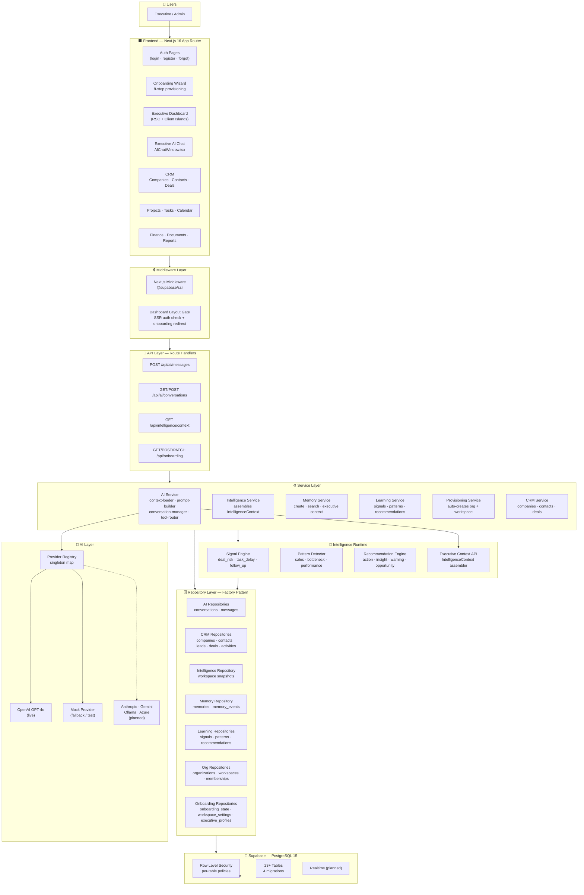
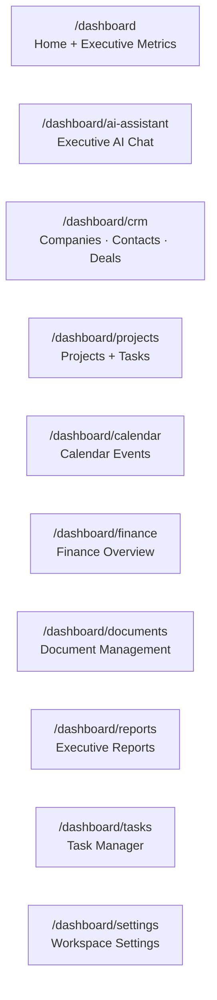
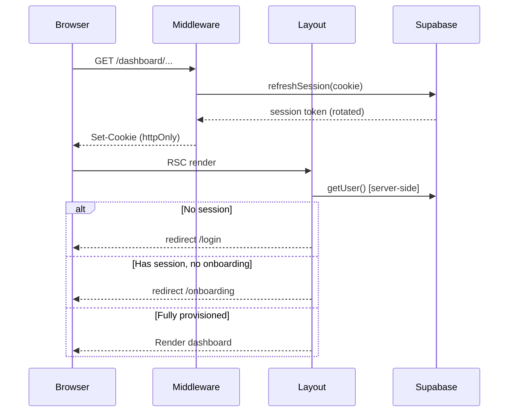
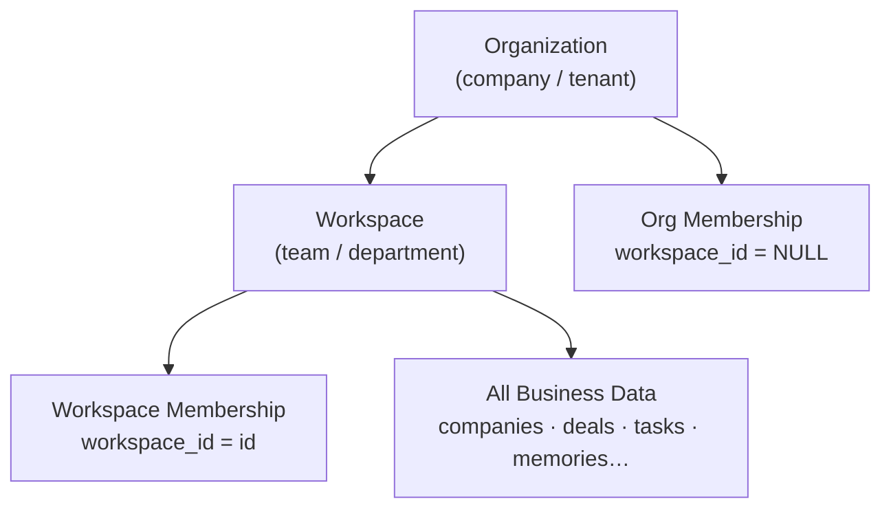
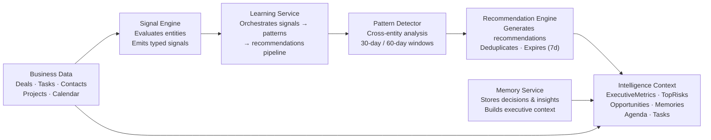
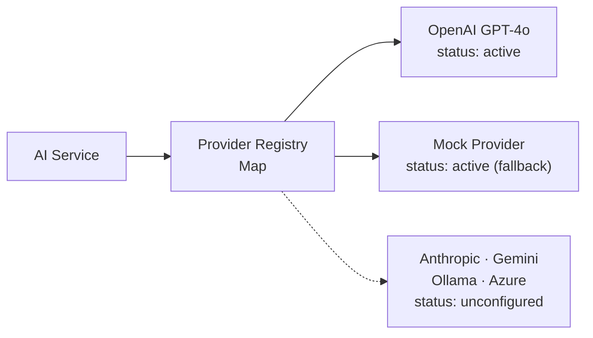
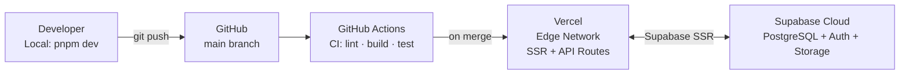

# MyBoss360 — System Architecture

> **Audience:** CTO, Senior Engineers, Investors, Enterprise Customers, AI Engineers
>
> **Release:** v1.0 Executive Foundation · June 2026

---

## 1. Executive Summary

MyBoss360 is an **Executive Operating System** — a production-grade SaaS platform that gives C-level executives a single, AI-native workspace where every business signal, relationship, project, and decision is continuously monitored, remembered, and acted upon.

The system is architected around three principles:

| Principle | Implementation |
|---|---|
| **Intelligence-first** | Every user action trains an evolving intelligence layer that adapts to each executive's business context |
| **Workspace isolation** | Multi-tenant from the ground up — organizations own workspaces; data never crosses tenant boundaries |
| **Production from day one** | Full SSR auth, service-role RLS bypass for provisioning, typed repositories, structured error handling |

**Technology stack at a glance:**

| Layer | Technology |
|---|---|
| Frontend | Next.js 16 App Router, React 19, Tailwind CSS, shadcn/ui |
| Backend | Next.js Route Handlers (API), TypeScript |
| Database | Supabase (PostgreSQL 15), Row Level Security |
| Auth | Supabase Auth with `@supabase/ssr` cookie-based SSR sessions |
| AI | Provider registry (OpenAI GPT-4o live; Anthropic/Gemini/Ollama/Azure planned) |
| Hosting | Vercel (frontend + API), Supabase Cloud (database) |
| CI/CD | GitHub + GitHub Actions |

---

## 2. Vision

> *"The executive who acts on complete information, at the right moment, consistently wins."*

MyBoss360 exists to eliminate the information asymmetry between what an executive should know and what they actually know at any given moment. The platform automatically surfaces risks, surfaces opportunities, monitors relationships, and remembers decisions — so the executive can focus on judgment, not information retrieval.

---

## 3. Product Philosophy

**The executive should not go to data. Data should come to the executive.**

This shapes every architectural decision:

- **Intelligence is always on.** The system continuously evaluates deals, tasks, projects, and contacts for signals — without the executive having to ask.
- **Memory is durable.** Decisions, meeting notes, strategic observations, and AI insights are stored as structured memories that persist and are fed back into the AI context on every interaction.
- **Context is always loaded.** When the executive opens a conversation with Executive AI, it already knows their pipeline value, overdue tasks, at-risk deals, today's agenda, and top recommendations — without prompting.
- **Multi-tenancy is non-negotiable.** Every table is scoped to an organization and workspace. RLS policies are the last line of defense, not the only line.

---

## 4. High-Level Architecture



---

## 5. Frontend

### App Router Groups

The frontend uses Next.js 16 App Router with four route groups, each with its own layout:

| Route Group | Layout | Protected? | Purpose |
|---|---|---|---|
| `(auth)` | Minimal centered layout | No | Login, register, forgot-password |
| `(onboarding)` | Minimal branded layout, no AppShell | No (auth only) | 8-step onboarding wizard |
| `(dashboard)` | Full AppShell (nav + topbar) | Yes — SSR gate | All executive features |
| `(marketing)` | Marketing layout | No | Public landing page |

### Dashboard Module Map



### Shared Component Architecture

```
components/
├── ui/                  shadcn/ui primitives (button, card, badge, dialog…)
├── ai/                  AIChatWindow, AIMessage, AIComposer, AIStatusBadge
├── crm/                 CRM-specific display components
├── dashboard/           Dashboard cards, charts, metric tiles
└── layout/              AppShell, Topbar, Navigation, UserMenu
```

### Key Frontend Patterns

- **React Server Components (RSC)** for data fetching: pages fetch data server-side and pass serialized props to client islands — eliminating client-side waterfall fetches for initial load.
- **Client islands** (`'use client'`) are scoped to interactive elements: the AI chat window, CRM forms, onboarding wizard.
- **Error boundaries** (`error.tsx`) on CRM and other data-heavy routes gracefully handle service failures.
- **Loading states** (`loading.tsx`) use React Suspense for skeleton UIs.

---

## 6. Backend

### API Routes

| Route | Method | Purpose | Auth |
|---|---|---|---|
| `/api/ai/messages` | POST | Send message to Executive AI | Required |
| `/api/ai/conversations` | GET | List conversations for workspace | Required |
| `/api/ai/conversations/[id]` | GET | Fetch conversation with messages | Required |
| `/api/intelligence/context` | GET | Fetch full IntelligenceContext | Required |
| `/api/onboarding` | GET | Get onboarding status | Required |
| `/api/onboarding` | POST | Provision workspace (idempotent) | Required |
| `/api/onboarding` | PATCH | Save wizard step / complete | Required |

All routes:
1. Call `createServerClient().auth.getUser()` first — return `401` if no session.
2. Wrap the entire body in `try/catch` — return `500` with JSON body on unexpected errors.
3. Use the **admin client** (`createAdminClient()`) only when provisioning or reading cross-tenant data (onboarding state).

### Service Layer

The service layer implements business logic. All services use the **factory pattern** — accepting a typed Supabase client rather than importing it globally, enabling clean dependency injection and testability.

```typescript
// Pattern: factory function returning an object of methods
export function createMemoryService(db: SupabaseClient<Database>) {
  return {
    async createMemory(input: CreateMemoryInput): Promise<Memory> { ... },
    async getExecutiveContext(workspaceId, organizationId): Promise<ExecutiveContext> { ... },
  }
}
```

| Service | File | Responsibility |
|---|---|---|
| `AIService` | `services/ai/ai-service.ts` | Orchestrates message send: load context → build prompt → call provider → save |
| `IntelligenceService` | `services/intelligence/intelligence-service.ts` | Assembles `IntelligenceContext` from all data sources in parallel |
| `MemoryService` | `services/memory/memory-service.ts` | CRUD for memories + executive context assembly |
| `LearningService` | `services/learning/learning-service.ts` | Signals, patterns, recommendations CRUD + pattern detection |
| `ProvisioningService` | `services/onboarding/provisioning-service.ts` | 10-step workspace provisioning with rollback |
| `OnboardingService` | `services/onboarding/onboarding-service.ts` | Wizard state machine, step persistence |
| `CRMService` | `services/crm/crm-service.ts` | Companies, contacts, deals, activities |
| `SignalEngine` | `services/intelligence/signal-engine.ts` | Evaluates entities and emits learning signals |
| `PatternDetector` | `services/intelligence/pattern-detector.ts` | Advanced cross-entity pattern detection |
| `RecommendationEngine` | `services/intelligence/recommendation-engine.ts` | Generates typed recommendations from patterns |

### Repository Layer

Repositories are the only layer that communicates with Supabase. They enforce type safety, throw on errors (never return null for mandatory entities), and expose a clean interface to services.

```
repositories/
├── ai/            conversations, messages
├── crm/           companies, contacts, leads, deals, activities
├── dashboard/     workspace snapshots (executive metrics)
├── intelligence/  intelligence aggregation queries
├── learning/      signals, patterns, recommendations, feedback
├── memory/        memories, memory_events
├── onboarding/    onboarding_state, workspace_settings, executive_profiles
├── organizations/ organizations, memberships
├── users/         profiles
└── workspaces/    workspaces
```

### Middleware

Authentication middleware (`@supabase/ssr`) intercepts all requests to `/dashboard/*` and refreshes the Supabase session cookie. The dashboard **layout** (`app/(dashboard)/layout.tsx`) performs the definitive auth check server-side and redirects to `/onboarding` if the user has not completed provisioning.

---

## 7. Authentication

### Flow



### Key Design Decisions

| Decision | Rationale |
|---|---|
| **`@supabase/ssr`** instead of `@supabase/auth-helpers-nextjs` | Cookie flags set correctly (httpOnly, SameSite, Secure) — prior helper exposed tokens to JavaScript |
| **Server-side `getUser()`** in layouts | Validates JWT cryptographically via Supabase server; not just a cookie read |
| **Dual client pattern** | `createServerClient()` for user-scoped operations (respects RLS); `createAdminClient()` for provisioning only |
| **`SUPABASE_SERVICE_ROLE_KEY` never in browser** | No `NEXT_PUBLIC_` prefix; used only in Route Handlers and Server Components |

### Protected Routes

| Route | Protection Mechanism |
|---|---|
| `/dashboard/*` | Middleware session refresh + layout `getUser()` |
| `/onboarding` | Layout `getUser()` (auth required, onboarding not required) |
| `/api/*` | Route Handler `getUser()` at the top of every handler |

---

## 8. Multi-Tenant Architecture

### Hierarchy



### Membership Model

MyBoss360 uses a **dual membership** pattern. Every user has two rows in the `memberships` table:

| Row | `workspace_id` | Purpose |
|---|---|---|
| Org membership | `NULL` | Grants access to the organization |
| Workspace membership | `<workspace.id>` | Required for `listForUser` inner join query |

This dual pattern is required because `listForUser()` uses a PostgREST inner join:
```typescript
.select('*, memberships!inner(user_id)')
.eq('memberships.user_id', userId)
```

### Row Level Security

RLS policies are enforced at the PostgreSQL layer via two security-definer helper functions:

```sql
-- Checks org-level or workspace-level membership
CREATE FUNCTION is_org_member(org_id UUID) RETURNS BOOLEAN ...
CREATE FUNCTION is_workspace_member(ws_id UUID) RETURNS BOOLEAN ...
```

| Table Group | SELECT Policy | INSERT Policy | UPDATE Policy |
|---|---|---|---|
| Core business tables | `is_workspace_member(workspace_id)` | `is_workspace_member(workspace_id)` | `is_workspace_member(workspace_id)` |
| `onboarding_state` | `user_id = auth.uid()` | Service role only | `user_id = auth.uid()` |
| `workspace_settings` | `is_workspace_member(workspace_id)` | Service role only | `is_workspace_member(workspace_id)` |
| `executive_profiles` | `user_id = auth.uid()` | Service role only | `user_id = auth.uid()` |
| `organizations` | `is_org_member(id)` | Service role only | `is_org_member(id)` |

### Tenant Isolation Guarantees

1. **Database layer**: RLS on every table — queries without valid session return empty result sets, not errors.
2. **Service layer**: Every service call accepts and validates `workspaceId` and `organizationId` from the authenticated session — never from user-supplied parameters alone.
3. **API layer**: Workspace resolution always starts from `workspacesRepo.listForUser(user.id)` — the user can only access workspaces they are members of.

---

## 9. Intelligence Runtime

The Intelligence Runtime is the continuous business monitoring layer that operates between raw data and the AI. It does not require the executive to ask questions — it proactively evaluates the workspace state and surfaces actionable insights.



### Signal Engine

Evaluates individual business entities and emits structured `learning_signals` when thresholds are crossed:

| Signal Type | Trigger |
|---|---|
| `deal_risk` | Deal approaching close date with low probability |
| `follow_up_delay` | Contact with no activity for configurable threshold |
| `task_delay` | High-priority task overdue |
| `customer_health` | Contact at risk of churn |
| `sales_pattern` | Win/loss pattern detected |
| `performance_trend` | KPI moving outside acceptable range |
| `workspace_created` | New workspace provisioned |

### Pattern Detector

Performs advanced cross-entity analysis using raw database queries over 30- and 60-day windows:

- Stale pipeline detection (deals not updated)
- Overdue task clusters across projects
- Contact engagement gaps
- Activity velocity trends

### Recommendation Engine

Converts patterns into actionable recommendations with deduplication and 7-day expiry:

| Recommendation Type | Example |
|---|---|
| `action` | "Follow up with Contact X — 14 days since last touch" |
| `insight` | "Average deal age increased 23% this month" |
| `warning` | "3 deals at risk of missing close date" |
| `opportunity` | "Company Y shows renewal signals" |

### Executive Context Assembly

The `IntelligenceContext` object — assembled by `IntelligenceService.getIntelligenceContext()` — aggregates all runtime outputs into a single structured payload that is injected into every AI prompt:

```typescript
interface IntelligenceContext {
  executiveMetrics: ExecutiveMetrics   // pipeline value, deal counts, task overdue
  recentMemories: Memory[]             // top 5 strategic memories
  activeRecommendations: Recommendation[]
  learningSignals: LearningSignal[]    // unresolved signals
  topRisks: ExecutiveRisk[]
  topOpportunities: ExecutiveOpportunity[]
  todayAgenda: TodayAgendaItem[]
  importantTasks: ImportantTask[]
}
```

---

## 10. AI Layer

See [ai-architecture.md](ai-architecture.md) for the complete AI layer specification.

### Provider Registry

A module-level singleton `Map<string, AIProvider>` that decouples the rest of the system from any specific LLM. Providers register at startup; the AI service resolves the best active provider at call time.



### Prompt Builder

`buildSystemPrompt()` constructs a structured system prompt by injecting the full `IntelligenceContext`. Sections are delimited with `--- SECTION ---` headers so the LLM can reason over structured business data. The prompt includes: identity, executive metrics, top risks, opportunities, active recommendations, strategic memories, today's agenda, and overdue tasks.

---

## 11. Deployment



### Environment Variables

| Variable | Required | Purpose |
|---|---|---|
| `NEXT_PUBLIC_SUPABASE_URL` | Yes | Supabase project URL (browser + server) |
| `NEXT_PUBLIC_SUPABASE_ANON_KEY` | Yes | Supabase anon key (browser + server) |
| `SUPABASE_SERVICE_ROLE_KEY` | Yes | Service-role key for provisioning (server only) |
| `OPENAI_API_KEY` | Yes (for live AI) | OpenAI GPT-4o API key |

### Migrations

Migrations are managed as plain SQL files in `supabase/migrations/`, applied via the Supabase Dashboard SQL Editor or `supabase db push`:

| Migration | Scope |
|---|---|
| `20260629000000_initial_schema.sql` | Core SaaS tables (23 tables), RLS, helper functions |
| `20260630000001_intelligence_schema.sql` | Memory Engine + Learning Engine tables |
| `20260630000002_ai_infrastructure.sql` | AI conversations, messages, organization_id backfill |
| `20260630000004_onboarding_schema.sql` | Onboarding state, workspace settings, executive profiles |

---

## 12. Future Roadmap

| Feature | Priority | Description |
|---|---|---|
| **Executive Profile Wizard** | High | Additional onboarding step collecting communication style, AI tone preferences |
| **Demo Data Seeding** | High | "Load demo CRM" toggle on onboarding finish step |
| **Workspace Settings Page** | High | Surface `workspace_settings` in `/dashboard/settings` |
| **AI Context Integration** | High | Inject `business_goals` and `currency` from workspace settings into system prompt |
| **Org Settings & Branding** | Medium | Custom org logo, colors, domain |
| **Multi-Workspace Support** | Medium | Workspace switcher in nav; users belong to multiple workspaces |
| **Anthropic / Gemini Providers** | Medium | Wire `FutureAnthropicProvider` and `FutureGeminiProvider` |
| **Real-Time Signals** | Medium | Supabase Realtime push for new signals to dashboard |
| **Voice Assistant** | Future | Voice-first interface powered by speech-to-text + Executive AI |
| **Multi-Agent System** | Future | Specialist sub-agents (CRM agent, Finance agent) coordinated by Executive AI |
| **MCP Integration** | Future | Model Context Protocol for tool ecosystem integration |
| **Knowledge Graph** | Future | Graph-based memory over entities and their relationships |
| **Mobile Apps** | Future | iOS / Android executive companion |
