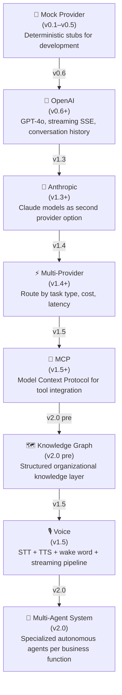
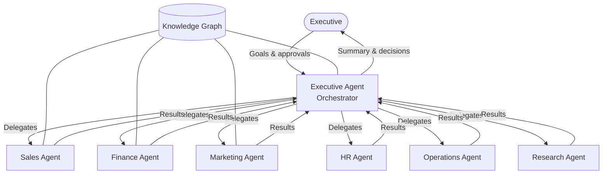

# AI Roadmap

MyBoss360's AI layer is designed to evolve continuously — from a simple mock provider in early development to a full multi-agent system that operates autonomously on behalf of the executive team.

---

## Evolution Overview



---

## Stage 1 — Mock Provider (v0.1–v0.5)

**Status:** Shipped

The mock provider was used throughout early development to build and test the AI interfaces without incurring API costs or requiring live credentials. It returned deterministic, hardcoded responses that exercised the full streaming pipeline.

**Architecture:**
- `ProviderInterface` abstraction defined from day one
- Mock implementation returns typed `StreamChunk` objects at a fixed cadence
- All upstream code is provider-agnostic — swapping providers requires no changes to routes or UI

**Key design decision:** Define the provider contract before writing any real provider. This meant the OpenAI integration in v0.6 required zero changes to the chat UI or API routes.

---

## Stage 2 — OpenAI (v0.6+)

**Status:** Shipped

GPT-4o is the primary AI model. All conversations stream via Server-Sent Events. The executive's workspace context (KPIs, recent activity) is injected into the system prompt at message dispatch time.

**Architecture:**
```
User message
    │
    ▼
app/api/ai/messages/route.ts
    │
    ├─ Workspace context fetch (intelligence API)
    ├─ System prompt construction
    ├─ OpenAI ChatCompletions (streaming)
    │
    ▼
SSE stream → AIChatWindow.tsx (incremental rendering)
```

**Current system prompt includes:**
- Workspace name and organization context
- Executive role and preferences
- Current date / time context
- Workspace KPI snapshot (metrics engine)

**Planned additions for v1.3:** top-K knowledge chunks retrieved from the Knowledge Engine (RAG context injection).

---

## Stage 3 — Anthropic (v1.3+)

**Status:** Planned · Target: Q3–Q4 2026

Add Claude (claude-sonnet-5 or equivalent) as a second provider option. Different models excel at different task types — Claude has demonstrated superior performance on long-document analysis, reasoning tasks, and structured output generation.

**Implementation plan:**
- Implement `AnthropicProvider` behind the same `ProviderInterface`
- Add `model` parameter to message dispatch (defaults to GPT-4o)
- Route specific task types to Claude: document summarization, contract analysis, research synthesis

**No UI changes required** — the provider is transparent to the chat interface.

---

## Stage 4 — Multi-Provider Routing (v1.4+)

**Status:** Planned · Target: Q4 2026

A routing layer selects the optimal provider per request based on configurable criteria.

**Routing dimensions:**

| Criterion | Example rule |
|---|---|
| Task type | Long document → Claude; Quick Q&A → GPT-4o |
| Latency requirement | Voice pipeline → lowest-latency model |
| Cost budget | Non-urgent tasks → cheaper model tier |
| Context length | >128k tokens → Claude 3.x long-context |
| Workspace preference | Per-workspace model override |

**Fallback:** If the primary provider returns an error, automatically retry with the secondary provider.

---

## Stage 5 — Model Context Protocol (v1.5+)

**Status:** Planned · Target: Q1 2027

MCP (Model Context Protocol) allows AI models to call structured tools with typed inputs and outputs. MyBoss360's MCP integration will expose the platform's own capabilities as tools the AI can invoke:

**Planned MCP tools:**

| Tool | Description |
|---|---|
| `search_knowledge` | Query the Knowledge Engine |
| `get_agenda` | Fetch executive calendar for a date range |
| `list_deals` | Query CRM pipeline with filters |
| `create_task` | Create a task in the workspace |
| `get_contact` | Retrieve contact information |
| `trigger_workflow` | Start an automation workflow |
| `get_metrics` | Fetch workspace KPIs |

MCP replaces ad-hoc function-calling JSON with a standardized, typed protocol that any MCP-compatible model can use.

---

## Stage 6 — Knowledge Graph (v2.0 pre)

**Status:** Planned · Target: H1 2027

The Knowledge Engine stores documents as chunks with vector embeddings. The Knowledge Graph adds a structured relationship layer on top — entities (people, companies, decisions, projects) and their typed relationships.

**Graph schema (planned):**

```
Person ──[works_at]──► Company
Person ──[made]──► Decision
Decision ──[references]──► Document
Document ──[supersedes]──► Document
Project ──[involves]──► Person
Deal ──[requires]──► Decision
```

**Capabilities unlocked by the graph:**
- "What decisions have we made about Acme Corp?" — traverses person → deal → decisions → documents
- "Who knows the most about our pricing strategy?" — traverses decisions → authors → expertise scores
- "What changed since the last board meeting?" — traverses time-filtered decision graph

The Knowledge Graph is the prerequisite for the Executive Agent in v2.0, which needs structured world-knowledge to reason about the organization.

---

## Stage 7 — Voice (v1.5)

**Status:** Planned · Target: Q1 2027

Voice-native interaction with the Executive OS. The executive can ask questions, dictate notes, and trigger actions by voice — on desktop, mobile, or a dedicated device.

**Pipeline:**

```
Wake word detection
    │
    ▼
Speech-to-Text (streaming)
    │
    ▼
Intent classification
    │
    ├─ Knowledge query → RAG search → TTS response
    ├─ Action command → MCP tool call → confirmation TTS
    └─ Dictation → document creation in Knowledge Engine
```

**Latency target:** < 800 ms from end of speech to first spoken word of response.

**Providers under evaluation:**
- STT: OpenAI Whisper, Google STT, Deepgram
- TTS: OpenAI TTS, ElevenLabs, Google TTS
- Wake word: Picovoice Porcupine (on-device, private)

---

## Stage 8 — Multi-Agent System (v2.0)

**Status:** Planned · Target: Q2–Q3 2027

The pinnacle of the MyBoss360 AI roadmap: a team of specialized autonomous agents that operate continuously on behalf of the executive organization.

**Agent architecture:**



**Agent properties:**
- Each agent has a dedicated system prompt encoding its function, constraints, and escalation rules
- Agents share a common Knowledge Graph but maintain private working memory
- All agent actions are logged to the audit trail
- Human-in-the-loop: agents escalate decisions above a configurable impact threshold
- The Executive Agent coordinates sub-agents, resolves conflicts, and surfaces summaries

**Runtime requirements for v2.0:**
- Agent orchestration runtime (task queue, result aggregation, retry)
- Inter-agent messaging bus (async, ordered, durable)
- Agent state persistence (per-agent context + shared graph)
- Approval gate UI (executive reviews and approves high-impact actions)
- Agent explainability (why did the agent make this recommendation?)

---

## AI Principles

These principles govern all AI features on the platform:

1. **Context over conversation** — every AI interaction should have access to the user's full organizational context, not just the current chat thread.
2. **Transparency** — AI-generated content is always marked as such; sources are citable.
3. **Human-in-the-loop** — high-impact actions require explicit human approval; AI suggests, humans decide.
4. **Provider independence** — no feature should be hardcoded to a single AI provider; all providers are interchangeable behind the `ProviderInterface`.
5. **Privacy by design** — user knowledge stays in their workspace; no cross-workspace data leakage; embeddings are computed per-workspace.
6. **Graceful degradation** — if the AI layer is unavailable, the platform continues to function as a structured knowledge and CRM tool.
