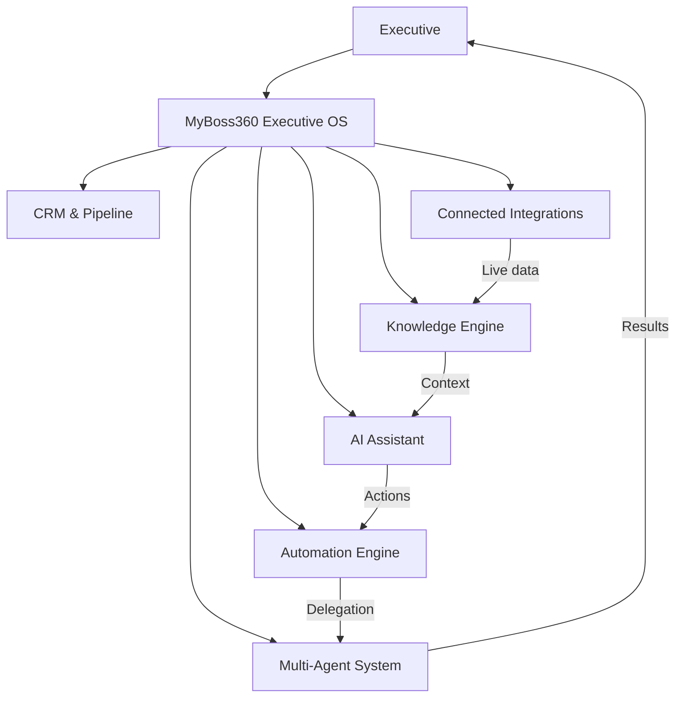

# Product Vision

## What is MyBoss360?

MyBoss360 is an **Executive Operating System** — an AI-native platform that gives business leaders a single, intelligent command centre for running their organization.

Most executives today operate across a fragmented landscape of tools: CRM for customer data, email for communication, calendar for scheduling, spreadsheets for reporting, chat for team coordination, and ad-hoc AI conversations for assistance. None of these tools share context. None of them know the executive as a person. None of them reduce cognitive load — they add to it.

MyBoss360 changes this. It connects every data source, understands the executive's priorities and decision style, and surfaces the right information at the right moment — before they have to ask.

---

## Why It Exists

Executives make hundreds of decisions per week. The quality of those decisions depends on:

1. **Access to the right context** — knowing what happened, what was decided, what is pending.
2. **Cognitive bandwidth** — not being overwhelmed by noise, administrative tasks, or context-switching.
3. **Institutional memory** — being able to build on past decisions rather than rediscovering them.

Today's software stack fails on all three dimensions. CRMs capture customer data but not executive intent. Knowledge bases store documents but don't surface them in context. AI assistants are powerful but stateless — they forget everything between sessions.

MyBoss360 was built to close these gaps: persistent memory, structured knowledge, intelligent search, and AI that knows the full context of your business.

---

## The Executive Operating System Vision

An operating system manages resources on behalf of the applications running on top of it. MyBoss360 does the same for the executive — it manages **information**, **decisions**, and **workflows** on behalf of the leader, so they can operate at their highest level.

The platform evolves in three generations:

| Generation | Version | Core Capability |
|---|---|---|
| **Individual Intelligence** | v1.x | One executive, AI-augmented decisions, connected data |
| **Agent Teams** | v2.x | Specialized AI agents operating autonomously across functions |
| **Enterprise Network** | v3.x | Cross-organization intelligence, benchmark insights, network effects |

---

## How MyBoss360 Differs from a CRM

| Dimension | CRM | MyBoss360 |
|---|---|---|
| **Primary user** | Sales team, account managers | CEO, COO, Founders, Executives |
| **Core data model** | Contacts, accounts, deals, pipeline stages | Decisions, knowledge, agenda, context |
| **Intelligence** | Reports, dashboards (reactive) | Proactive AI — surfaces insights without being asked |
| **Memory** | Structured data only | Structured + unstructured + conversational memory |
| **Workflow scope** | Sales pipeline management | Full executive operating surface (finance, HR, ops, marketing) |
| **AI role** | Optional add-on (CoPilot features) | Core runtime — every interaction is AI-mediated |
| **Integration model** | CRM-centric (Salesforce, HubSpot APIs) | Executive-centric (email, calendar, docs, CRM all flow in) |

MyBoss360 includes a CRM module, but CRM is one component of the platform — not the platform itself.

---

## How MyBoss360 Differs from ChatGPT / Generic AI

| Dimension | General AI (ChatGPT, Claude) | MyBoss360 |
|---|---|---|
| **Memory** | Stateless — forgets between sessions | Persistent — knows your business, your team, your history |
| **Context** | What you paste into the prompt | Connected to your real data: calendar, email, CRM, documents |
| **Knowledge** | World knowledge (training cutoff) | Your institutional knowledge (Knowledge Engine) |
| **Actions** | Text responses only | Can trigger workflows, approvals, notifications, agent tasks |
| **Personalization** | None — same model for all users | Knows your decision style, priorities, and business context |
| **Security** | Your data sent to a third party | Self-hosted knowledge layer; data stays in your workspace |
| **Agents** | Single-turn or limited tools | Purpose-built multi-agent system for business functions |

Generic AI is a powerful tool. MyBoss360 is a purpose-built operating system that uses AI as its core engine. The difference is between a powerful calculator and an accountant who knows your business.

---

## Long-Term Vision

### 2026 — The Intelligent Executive Layer

Every executive has a personal AI assistant that knows their organization's full context: every document, every decision, every meeting, every customer. The assistant proactively surfaces what matters and reduces the time spent on information retrieval from hours to seconds.

### 2027 — The Multi-Agent Executive Team

Specialized agents operate continuously on behalf of the executive team. The Sales Agent monitors pipeline and flags risk before the weekly review. The Finance Agent catches budget anomalies before month-end. The Research Agent produces competitive briefs overnight. Humans focus on decisions; agents handle analysis and execution.

### 2028 — The Executive Network

Aggregated (anonymized) intelligence across organizations creates benchmark insights: industry conversion rates, compensation bands, operational efficiency scores. Executives can compare their organization against peer benchmarks in real time. Network effects compound the value of the platform as more organizations participate.

### The Enduring Principle

> **The executive's time is the most valuable resource in any organization. Every feature of MyBoss360 must demonstrably save executive time, reduce cognitive load, or improve decision quality. Features that do not serve this principle are not built.**
