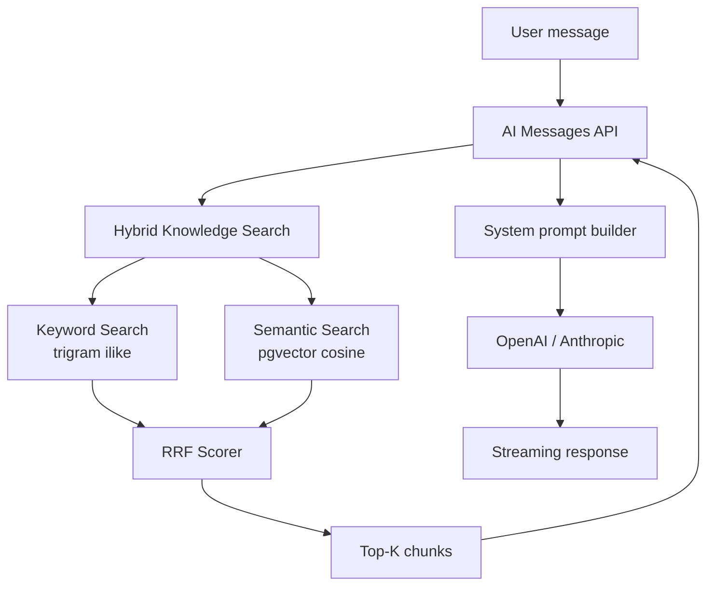

# v1.3 — Knowledge Intelligence

**Status:** Planned  
**Theme:** Activate the RAG layer — embeddings, vector search, and AI-powered document intelligence  
**Target:** Q3–Q4 2026

---

## Objective

v1.1 built the Knowledge Engine schema and pipeline. v1.3 activates it.

With v1.3, every document chunk is embedded and stored as a vector. The AI assistant can now retrieve the most semantically relevant knowledge for any question the executive asks — rather than relying solely on keyword matching or the training data of the underlying model.

This is the release where MyBoss360 starts to feel qualitatively different from a generic AI assistant: it knows your business, your decisions, and your institutional history — and it surfaces that knowledge in every conversation.

---

## Features

### OpenAI Embeddings

Embed every chunk in the `knowledge_chunks` table using OpenAI `text-embedding-3-small` (1536 dimensions, optimized for retrieval tasks).

**Embedding triggers:**
- `createDocument` → embed all chunks on creation
- `updateDocument` (content changed) → delete old chunks, embed new chunks
- Backfill job → embed all existing chunks without embeddings at v1.3 launch

**Cost estimate:** `text-embedding-3-small` costs ~$0.02 / 1M tokens. A typical 10-page document (~5,000 words, ~6,667 tokens) split into ~13 chunks costs < $0.001 to embed. Embedding 10,000 documents costs ~$10.

### pgvector Extension

Enable the `pgvector` Postgres extension in Supabase and add a vector column to `knowledge_chunks`:

```sql
ALTER TABLE knowledge_chunks
    ADD COLUMN embedding vector(1536);

CREATE INDEX knowledge_chunks_embedding_idx
    ON knowledge_chunks
    USING ivfflat (embedding vector_cosine_ops)
    WITH (lists = 100);
```

**Index strategy:** IVFFlat with 100 lists — appropriate for corpora up to ~1M chunks. Switch to HNSW (`pg_vector 0.5+`) when approaching 10M chunks.

### Semantic Search (Live)

Replace the mock `semanticSearch` implementation with real vector similarity search:

```typescript
// 1. Embed the user's query
const queryEmbedding = await openai.embeddings.create({
  model: 'text-embedding-3-small',
  input: query.query,
})

// 2. Search by vector similarity (cosine distance)
const { data } = await db.rpc('search_knowledge_chunks', {
  query_embedding: queryEmbedding.data[0].embedding,
  match_threshold: 0.75,
  match_count: query.limit ?? 10,
  workspace_id: query.workspaceId,
})
```

### Hybrid Search with RRF (Live)

Combine keyword and semantic search using Reciprocal Rank Fusion:

```
score_rrf(document) = Σ  1 / (k + rank_i)
                     i ∈ {keyword_rank, semantic_rank}
where k = 60 (standard RRF constant)
```

A document ranked #1 in keyword and #3 in semantic scores higher than one ranked #1 in only one modality. This produces more robust results than either signal alone.

### AI Context Injection

Inject top-K knowledge chunks into the AI assistant's system prompt for every message:

```
System prompt:
  [Executive context]
  [Workspace KPIs]
  [Relevant knowledge — top-5 chunks by hybrid search score]
      - Source: "Q4 2025 Sales Playbook" (relevance: 0.91)
        "...our enterprise pricing starts at $2,000/month..."
      - Source: "Board Meeting Notes 2026-03-15" (relevance: 0.87)
        "...approved expansion into LATAM by Q3..."
  [User message]
```

The executive no longer needs to provide context — the system retrieves it automatically.

### Knowledge Ranking

Score documents by multiple signals to surface the most relevant and authoritative knowledge:

| Signal | Weight | Description |
|---|---|---|
| Vector similarity | 0.40 | Cosine distance to query embedding |
| Keyword match | 0.25 | Trigram score from keyword search |
| Recency | 0.20 | Exponential decay from `updated_at` |
| Access frequency | 0.10 | How often this document has been retrieved |
| Author authority | 0.05 | Creator's role weight (executive > manager > viewer) |

### Document Intelligence

Automatic enrichment on document creation:

| Feature | Description |
|---|---|
| Auto-tagging | Suggest tags based on content (NLP classification) |
| Entity extraction | Identify people, companies, dates, amounts mentioned |
| Summary generation | AI-generated one-paragraph summary stored in `metadata` |
| Related document suggestions | Surface documents with high embedding similarity |

### Anthropic Provider

Add `claude-sonnet-5` as a second AI provider behind the `ProviderInterface`. Route long-document tasks (>20,000 tokens) to Claude for its superior long-context performance.

### RBAC

Full role-based access control:
- Predefined roles: `owner`, `admin`, `executive`, `manager`, `viewer`
- Custom role composition
- Role enforcement on all API routes (not just RLS)

### Audit Logs

Append-only audit trail for all state changes. See [SECURITY_ROADMAP.md](../SECURITY_ROADMAP.md) for schema detail.

---

## Architecture



---

## Success Criteria

| Criterion | Target |
|---|---|
| All chunks embedded at launch | Backfill job completes within 1 hour for initial corpus |
| Semantic search latency | p95 < 200 ms for corpora up to 100,000 chunks |
| Hybrid search latency | p95 < 300 ms |
| AI context injection | Every message gets ≤ 5 knowledge chunks injected |
| Anthropic provider functional | Routes long-doc tasks correctly |
| RBAC enforced | All API routes validate role permissions |
| Audit log covers all mutations | 100% of document/contact/deal writes logged |
| Knowledge UI shipped | Browse, search, and edit documents in-app |
| Test coverage ≥ 70% | Vitest + V8 |
| Lint clean + build passes | 0 errors |

---

## Dependencies

- `pgvector` Postgres extension (Supabase Pro tier)
- OpenAI API key (for `text-embedding-3-small`)
- Anthropic API key (for Claude provider)
- v1.1 Knowledge Engine (schema + pipeline) — already shipped
- v1.2 Google Drive integration (for document corpus — optional but synergistic)
