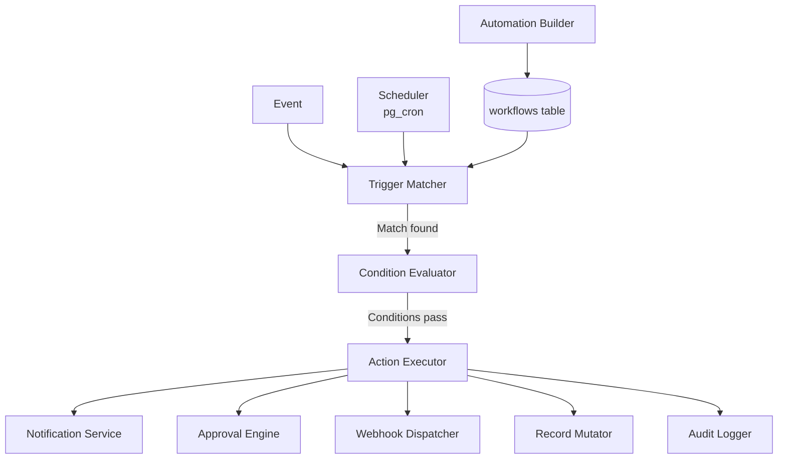

# v1.4 — Executive Automation

**Status:** Planned  
**Theme:** Automate executive workflows — approvals, notifications, and scheduled actions  
**Target:** Q4 2026

---

## Objective

Executives spend a significant portion of their time on coordination overhead: following up on approvals, chasing status updates, sending reminders, and triggering next steps based on known conditions. This is work that a well-configured system should do automatically.

v1.4 introduces the Workflow Engine — an event-driven automation runtime that allows executives and their teams to define rules ("when X happens, do Y") without writing code. Built on top of this engine are an Approval Engine for structured decision routing, a no-code Automation Builder for rule creation, a multi-channel notification system, and scheduled action support.

After v1.4, repetitive coordination tasks are no longer manual. The executive defines the logic once; MyBoss360 executes it continuously.

---

## Features

### Workflow Engine

The core of v1.4: an event-driven action graph that connects triggers to actions.

**Architecture:**
```
Event source (deal updated, document created, calendar event, schedule)
    │
    ▼
Trigger evaluation
    │  Does this event match the trigger condition?
    ▼
Condition check (optional)
    │  e.g., "only if deal value > $50,000"
    ▼
Action execution
    │  send_notification | create_task | trigger_approval | update_record | call_webhook
    ▼
Result logging (audit trail)
```

**Event sources:**
- CRM events: contact created, deal stage changed, activity overdue
- Knowledge events: document created/updated, version snapshot taken
- Calendar events: meeting starting in 15 minutes, event created
- Schedule triggers: cron expressions (daily at 08:00, weekly on Monday)
- Manual triggers: button in UI that fires a named workflow
- AI agent outputs: agent completes a research task (v2.0+)

**Action types:**
- `send_notification` — email, in-app, or push (configurable per recipient)
- `create_task` — add a task to the workspace with assignee and due date
- `trigger_approval` — route a request to approvers via the Approval Engine
- `update_record` — update a field on a CRM record or document
- `call_webhook` — POST to an external URL (for Zapier/Make compatibility)
- `create_knowledge_document` — auto-create a document from a template
- `assign_agent_task` — delegate to an AI agent (v2.0+)

### Approval Engine

Structured request → review → approve/reject workflow for decisions that require human sign-off.

**Approval schema:**
```sql
CREATE TABLE approval_requests (
    id              UUID PRIMARY KEY DEFAULT gen_random_uuid(),
    workspace_id    UUID REFERENCES workspaces(id),
    workflow_id     UUID REFERENCES workflows(id),
    requestor_id    UUID REFERENCES profiles(id),
    title           TEXT NOT NULL,
    description     TEXT,
    resource_type   TEXT,      -- 'deal' | 'document' | 'custom'
    resource_id     UUID,
    status          TEXT DEFAULT 'pending',  -- pending | approved | rejected | expired
    approvers       JSONB,     -- ordered list of approver user IDs / roles
    approved_by     UUID[],
    rejected_by     UUID,
    rejection_reason TEXT,
    expires_at      TIMESTAMPTZ,
    created_at      TIMESTAMPTZ DEFAULT NOW(),
    updated_at      TIMESTAMPTZ DEFAULT NOW()
);
```

**Approval patterns:**
- **Single approver** — any one of N designated approvers can approve
- **Sequential** — approvers must approve in order (Approver 1 → Approver 2 → ...)
- **Unanimous** — all designated approvers must approve
- **Threshold** — M of N approvers must approve

**Audit integration:** Every approval action (submit, approve, reject, expire) is logged to the audit trail.

### Automation Builder

A no-code rule editor in the dashboard that allows workspace admins and executives to create and manage workflows without engineering involvement.

**UI components:**
- Trigger selector (event type + optional filter)
- Condition builder (field comparison, logical AND/OR)
- Action configurator (per action type, with dynamic fields)
- Workflow list (name, trigger, status, last run, run count)
- Workflow run history (per-run log with status and timing)

### Notifications

Multi-channel notification delivery integrated with the Workflow Engine.

| Channel | Implementation |
|---|---|
| In-app | Notification bell + dropdown; unread count badge |
| Email | Transactional email (Resend or SendGrid) with workspace branding |
| Push (web) | Web Push API via service worker |
| Push (mobile) | APNs / FCM (when mobile apps ship in v1.x) |

**Notification preferences:** Each user can configure which channels are active per notification type (approval requests, deal updates, task assignments, etc.).

### Scheduled Actions

Cron-style recurring automations:

```typescript
// Example: send weekly pipeline digest every Monday at 08:00
{
  trigger: { type: 'schedule', cron: '0 8 * * 1' },
  actions: [
    { type: 'send_notification', template: 'weekly_pipeline_digest', recipients: ['owner'] }
  ]
}
```

**Implementation:** Supabase pg_cron extension (or Edge Function cron) for schedule management. Each scheduled run creates an execution record for audit trail.

---

## Architecture



---

## Database Schema (Overview)

```sql
-- Workflow definition
CREATE TABLE workflows (
    id           UUID PRIMARY KEY DEFAULT gen_random_uuid(),
    workspace_id UUID REFERENCES workspaces(id),
    name         TEXT NOT NULL,
    trigger      JSONB NOT NULL,     -- event type + filter
    conditions   JSONB,              -- optional condition tree
    actions      JSONB NOT NULL,     -- ordered action list
    status       TEXT DEFAULT 'active',
    created_by   UUID REFERENCES profiles(id),
    created_at   TIMESTAMPTZ DEFAULT NOW(),
    updated_at   TIMESTAMPTZ DEFAULT NOW()
);

-- Execution log (append-only)
CREATE TABLE workflow_runs (
    id           UUID PRIMARY KEY DEFAULT gen_random_uuid(),
    workflow_id  UUID REFERENCES workflows(id),
    workspace_id UUID REFERENCES workspaces(id),
    trigger_data JSONB,
    status       TEXT,   -- 'success' | 'failed' | 'pending_approval'
    actions_log  JSONB,  -- per-action result
    started_at   TIMESTAMPTZ DEFAULT NOW(),
    completed_at TIMESTAMPTZ
);
```

---

## Success Criteria

| Criterion | Target |
|---|---|
| Workflow engine processes event within 5 seconds | End-to-end latency SLA |
| Approval request notifies all approvers within 30 seconds | Notification SLA |
| Automation Builder allows creating a workflow without code | No-code UX |
| In-app notifications appear in real time | Supabase Realtime subscription |
| Email notifications delivered within 60 seconds | Email provider SLA |
| All workflow runs logged to audit trail | 100% coverage |
| Workflow failures surface clear error messages | UX + logging |
| Scheduled actions fire within 60 seconds of schedule | pg_cron accuracy |
| Test coverage ≥ 70% | Vitest + V8 |
| Lint clean + build passes | 0 errors |

---

## Dependencies

- v1.3 RBAC (permission gating for workflow creation)
- v1.3 Audit Logs (run history + approval audit trail)
- Email provider (Resend or SendGrid) — new dependency
- Supabase `pg_cron` extension for scheduled triggers
- Supabase Realtime for in-app notification push
