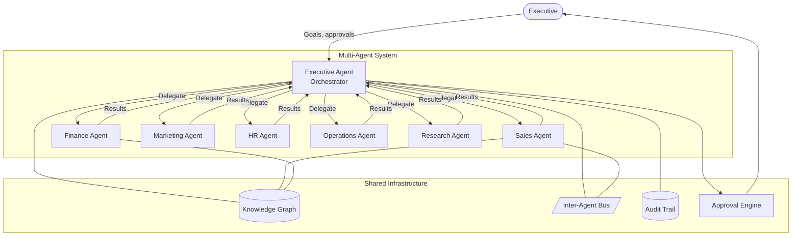

# v2.0 — Executive Multi-Agent System

**Status:** Planned  
**Theme:** A team of specialized AI agents that operate autonomously on behalf of the executive organization  
**Target:** Q2–Q3 2027

---

## Objective

v2.0 is the platform generation shift for MyBoss360. The v1.x series built the individual executive intelligence layer: knowledge, search, connected data, automation, and voice. v2.0 turns that foundation into a team.

In the Multi-Agent System, each business function has a dedicated AI agent with specialized knowledge, tools, and authority. These agents work continuously — monitoring, analyzing, and acting — and surface results to the executive for final review. The Executive Agent coordinates all sub-agents, resolves cross-functional conflicts, and maintains the executive's strategic context.

The goal is not to replace human judgment. The goal is to eliminate the analytical and administrative work that precedes judgment, so that human decision-making is applied only where it genuinely matters.

---

## Agent Roster

### Executive Agent

**Role:** Orchestrator and coordinator of all sub-agents.

The Executive Agent is the executive's primary interlocutor. It:
- Receives high-level goals from the executive
- Decomposes goals into tasks and delegates to appropriate sub-agents
- Monitors sub-agent progress and escalates blockers
- Aggregates sub-agent results into executive summaries
- Maintains the executive's strategic context across all sessions
- Routes approval requests through the Approval Engine
- Produces the daily/weekly Executive Briefing

**Tools available:** All MCP tools; direct API access to all sub-agents; Knowledge Graph read/write.

---

### Sales Agent

**Role:** Autonomous pipeline management and revenue intelligence.

| Capability | Description |
|---|---|
| Pipeline monitoring | Track deal stages; flag stalled deals (no activity > N days) |
| Opportunity scoring | Score deals by close probability using historical patterns |
| Follow-up automation | Draft and send follow-up emails on behalf of the executive |
| Win/loss analysis | After close, classify outcome and update playbook knowledge |
| Forecast generation | Weekly revenue forecast with confidence intervals |
| CRM hygiene | Flag missing fields, duplicate contacts, outdated data |

**Data access:** CRM (full read/write), email threads (read), calendar (read), Knowledge Engine (read).

---

### Finance Agent

**Role:** Budget monitoring, forecast alerts, and expense management.

| Capability | Description |
|---|---|
| Budget monitoring | Track actual vs. budget in real time; alert on variance > threshold |
| Forecast alerts | Flag when quarterly targets are at risk based on current trajectory |
| Expense approvals | Route expense requests through Approval Engine; apply policy rules |
| Runway calculation | Update cash runway estimate weekly based on burn rate |
| Invoice management | Track outstanding receivables; flag overdue invoices |
| Financial briefing | Monthly P&L summary with commentary |

**Data access:** Financial records (full read), approval engine (write), Knowledge Engine (read/write).

---

### Marketing Agent

**Role:** Campaign performance, content generation, and audience intelligence.

| Capability | Description |
|---|---|
| Campaign monitoring | Track conversion rates, CPL, ROAS across active campaigns |
| Content generation | Draft blog posts, email campaigns, social copy from knowledge base |
| Audience insights | Segment analysis, cohort performance, churn signals |
| Competitor monitoring | Summarize competitor announcements and product changes |
| Brand mentions | Monitor web/social for brand mentions; surface notable items |
| Content calendar | Propose and manage content publishing schedule |

**Data access:** Marketing analytics (read), Knowledge Engine (read/write), CRM contacts (read).

---

### HR Agent

**Role:** People analytics, onboarding coordination, and performance tracking.

| Capability | Description |
|---|---|
| People analytics | Headcount trends, attrition risk scoring, team capacity |
| Onboarding coordination | New hire task tracking; flag blocked onboarding items |
| Performance tracking | OKR progress monitoring; alert on at-risk objectives |
| Engagement signals | Survey response analysis, meeting attendance patterns |
| Policy Q&A | Answer HR policy questions using Knowledge Engine (policies, SOPs) |
| Org chart maintenance | Detect and flag stale org chart data |

**Data access:** HR records (full read), Knowledge Engine (read), approval engine (write).

---

### Operations Agent

**Role:** Process monitoring, bottleneck detection, and resource optimization.

| Capability | Description |
|---|---|
| Process monitoring | Track KPIs on operational processes; alert on degradation |
| Bottleneck detection | Identify queued or blocked work items across teams |
| Resource allocation | Surface under-utilized and over-allocated resources |
| SLA monitoring | Track vendor and internal SLA adherence; flag breaches |
| Incident response | Detect anomalies; initiate predefined response workflows |
| Operational briefing | Weekly operational health report |

**Data access:** Project/task data (full read), workflow engine (read), Knowledge Engine (read/write).

---

### Research Agent

**Role:** Market intelligence, competitor analysis, and strategic research.

| Capability | Description |
|---|---|
| Market research | Gather and synthesize market data from configured sources |
| Competitor analysis | Track competitor pricing, product launches, and press releases |
| Industry news digest | Daily digest of relevant industry news filtered by workspace context |
| Research reports | On-demand deep-dive reports stored in Knowledge Engine |
| Due diligence | Gather background data on prospects, partners, and acquisition targets |
| Trend analysis | Identify emerging trends in the executive's industry |

**Data access:** External web sources (via approved tool), Knowledge Engine (read/write), CRM (read).

---

## Agent Runtime Architecture

### Agent Execution Model

Each agent runs as an independent process with:
- **Private context window** — per-agent short-term memory (current task state)
- **Shared Knowledge Graph** — read/write access to organizational knowledge
- **Tool access** — scoped MCP tool set per agent role
- **Task queue** — agents pick up delegated tasks from the inter-agent bus
- **Result emission** — completed tasks emitted to the bus; Executive Agent aggregates

### Human-in-the-Loop Gates

High-impact actions require explicit executive approval before execution:

| Impact level | Definition | Gate |
|---|---|---|
| Low | Read-only, informational | None — agent acts automatically |
| Medium | Write to internal systems (create document, update CRM) | Logged; executive can undo |
| High | External communication, financial commitment, approval | Explicit executive approval via Approval Engine |
| Critical | Irreversible action, large financial impact | Requires two executive approvals |

The Executive Agent is responsible for classifying action impact and routing accordingly.

---

## Knowledge Graph (v2.0 prerequisite)

The Knowledge Engine in v1.1–v1.3 stores documents as chunks with embeddings. v2.0 adds a structured graph layer:

**Entity types:** Person, Company, Product, Project, Decision, Document, Deal, Event  
**Relationship types:** works_at, manages, made, references, supersedes, involves, related_to

**Agent use of the graph:**
- **Sales Agent:** "What decisions have been made about Acme Corp?" → traverse Company → Decisions
- **Research Agent:** "Who internally knows the most about our pricing strategy?" → traverse Decisions → Authors → expertise
- **Executive Agent:** "What has changed since last week?" → time-filtered graph delta

---

## Success Criteria

| Criterion | Target |
|---|---|
| Executive Agent orchestrates ≥ 3 sub-agents in a single goal | Demonstrated in user acceptance testing |
| Sub-agent task latency | p95 < 30 seconds for non-research tasks |
| High-impact action always routes to approval | 100% of classified high-impact actions blocked until approved |
| All agent actions logged | 100% coverage in audit trail |
| Knowledge Graph traversal latency | p95 < 500 ms for depth-3 graph queries |
| Agent briefings delivered on schedule | Daily Executive Briefing 08:00 local time, 99.5% reliability |
| No cross-workspace data access | Zero incidents in security testing |
| Test coverage ≥ 70% | Vitest + V8 |
| Lint clean + build passes | 0 errors |

---

## Dependencies

- v1.3 Knowledge Intelligence (RAG + Knowledge Engine fully operational)
- v1.4 Executive Automation (Workflow Engine + Approval Engine)
- v1.5 Executive Voice (optional but synergistic — voice interface to agent outputs)
- Agent orchestration runtime (new infrastructure — design TBD in pre-v2.0 sprint)
- Inter-agent messaging bus (Supabase Realtime or dedicated queue)
- Knowledge Graph migration (new tables extending the Knowledge Engine schema)
- MCP server registration for all platform tools
- Model Context Protocol client in agent runtime

---

## Platform Generation Comparison

| Dimension | v1.x (Individual Intelligence) | v2.0 (Multi-Agent Teams) |
|---|---|---|
| **Who acts** | AI assistant answers questions | Specialized agents act continuously |
| **Initiative** | Reactive (executive asks) | Proactive (agents monitor and alert) |
| **Scope** | Single session, single user | Multi-agent, cross-functional |
| **Memory** | Conversation + knowledge chunks | Knowledge Graph + per-agent state |
| **Coordination** | None | Executive Agent orchestrates sub-agents |
| **Human role** | Conversational partner | Strategic director and approver |
