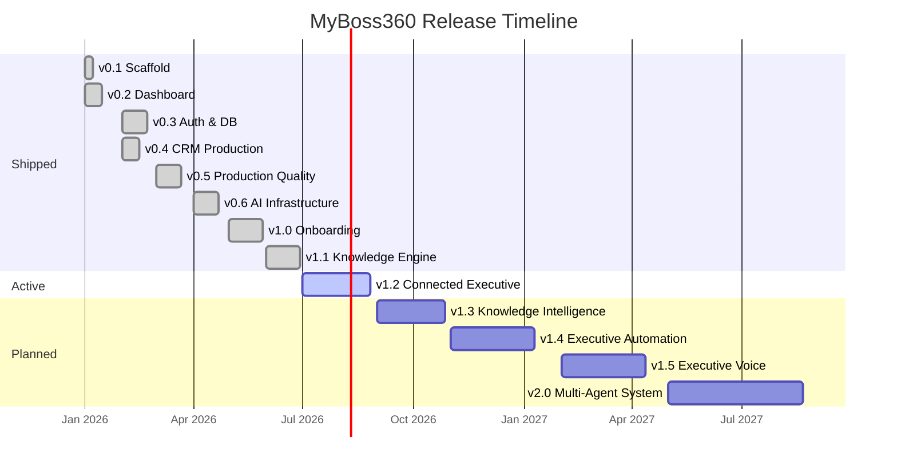

# Release Board

> Last updated: 2026-07-01

---

## Current Release

### v1.1 — Knowledge Engine

**Status:** Shipped  
**Theme:** RAG Foundation — permanent knowledge layer for the platform  
**Commit range:** `51f78f8` → `2ef3356`

| # | Feature | Status |
|---|---|---|
| 1 | 9-table knowledge schema (collections, documents, chunks, tags, links, versions, permissions) | ✅ Shipped |
| 2 | Document pipeline: parse → normalize → chunk (4 strategies) | ✅ Shipped |
| 3 | Keyword search (trigram GIN index, live) | ✅ Shipped |
| 4 | Semantic search interface (mock, reserved for v1.3) | ✅ Shipped |
| 5 | Hybrid search interface (mock, reserved for v1.3) | ✅ Shipped |
| 6 | Knowledge REST API (GET / POST / PATCH / DELETE) | ✅ Shipped |
| 7 | Document versioning (immutable snapshots before each update) | ✅ Shipped |
| 8 | Per-document ACL (user or role permissions) | ✅ Shipped |
| 9 | PostgREST filter injection hardening | ✅ Shipped |
| 10 | Enterprise architecture documentation (4 docs) | ✅ Shipped |

---

## Shipped Releases

| Version | Theme | Status | Key Deliverables |
|---|---|---|---|
| v0.1 | Scaffold & Homepage | ✅ Shipped | Next.js 16, shadcn/ui, marketing homepage |
| v0.2 | Dashboard & CRM Shell | ✅ Shipped | Premium dashboard shell, CRM workspace UI |
| v0.3 | Auth & Database Foundation | ✅ Shipped | Supabase SSR auth, multi-tenant schema (21 tables), RLS |
| v0.4 | CRM Production | ✅ Shipped | Real CRM service, repository layer, seed data |
| v0.5 | Production Quality | ✅ Shipped | Executive metrics engine, memory & learning engine, production hardening |
| v0.6 | AI Infrastructure | ✅ Shipped | Executive AI runtime, OpenAI provider, streaming chat |
| v1.0 | Executive Onboarding | ✅ Shipped | 8-step onboarding wizard, workspace auto-provisioning, dashboard gate |
| **v1.1** | **Knowledge Engine** | ✅ **Shipped** | Document pipeline, RAG schema, keyword search, knowledge API |

---

## Planned Releases

### v1.2 — Connected Executive

**Theme:** Google Workspace integration — bring external context into the executive layer  
**Target:** Q3 2026

| # | Feature | Priority |
|---|---|---|
| 1 | Google Calendar — event sync, executive agenda view | P0 |
| 2 | Google Gmail — email ingestion, thread summarization | P0 |
| 3 | Google Contacts — contact enrichment, CRM sync | P1 |
| 4 | Google Drive — document ingestion into Knowledge Engine | P1 |
| 5 | Executive Agenda — unified daily/weekly view (calendar + tasks + priorities) | P0 |
| 6 | OAuth 2.0 credential store (per-workspace, encrypted) | P0 |
| 7 | Sync engine (webhook + polling fallback) | P1 |

---

### v1.3 — Knowledge Intelligence

**Theme:** Activate the RAG layer — embeddings, vector search, and document intelligence  
**Target:** Q3–Q4 2026

| # | Feature | Priority |
|---|---|---|
| 1 | OpenAI Embeddings integration (`text-embedding-3-small`) | P0 |
| 2 | pgvector extension — vector column on `knowledge_chunks` | P0 |
| 3 | Semantic search (live — replace mock) | P0 |
| 4 | Hybrid search with Reciprocal Rank Fusion (live — replace mock) | P1 |
| 5 | Knowledge ranking (recency × authority × relevance scoring) | P1 |
| 6 | Document Intelligence — automatic tagging, entity extraction | P2 |
| 7 | AI assistant context injection (top-K chunks per message) | P0 |
| 8 | Incremental re-embedding (only changed chunks) | P1 |

---

### v1.4 — Executive Automation

**Theme:** Automate executive workflows — approvals, notifications, scheduled actions  
**Target:** Q4 2026

| # | Feature | Priority |
|---|---|---|
| 1 | Workflow Engine — event-driven action graph | P0 |
| 2 | Approval Engine — request → review → approve/reject with audit trail | P0 |
| 3 | Automation Builder — no-code rule editor (if/then triggers) | P1 |
| 4 | Notifications — multi-channel delivery (email, in-app, push) | P0 |
| 5 | Scheduled Actions — cron-style recurring automations | P1 |
| 6 | Automation audit log | P1 |

---

### v1.5 — Executive Voice

**Theme:** Voice-native interaction with the Executive OS  
**Target:** Q1 2027

| # | Feature | Priority |
|---|---|---|
| 1 | Voice Assistant — conversational interface to the AI layer | P0 |
| 2 | Speech-to-Text — real-time transcription (meeting notes, commands) | P0 |
| 3 | Text-to-Speech — AI responses read aloud | P1 |
| 4 | Conversation Streaming — low-latency voice response pipeline | P0 |
| 5 | Wake Word — hands-free activation | P2 |

---

### v2.0 — Executive Multi-Agent System

**Theme:** Specialized AI agents that operate autonomously on behalf of the executive team  
**Target:** Q2–Q3 2027

| # | Agent | Responsibility |
|---|---|---|
| 1 | Executive Agent | Orchestrates all sub-agents; handles cross-functional decisions |
| 2 | Sales Agent | Pipeline management, opportunity scoring, follow-up automation |
| 3 | Finance Agent | Budget monitoring, forecast alerts, expense approvals |
| 4 | Marketing Agent | Campaign performance, content generation, audience insights |
| 5 | HR Agent | People analytics, onboarding tasks, performance tracking |
| 6 | Operations Agent | Process monitoring, bottleneck detection, resource allocation |
| 7 | Research Agent | Market intelligence, competitor analysis, report generation |

**Platform requirements for v2.0:**
- Agent orchestration runtime (task delegation, result aggregation)
- Inter-agent messaging protocol
- Agent memory (per-agent context window + shared knowledge graph)
- Human-in-the-loop approval gates
- Agent audit trail and explainability

---

## Release Timeline

